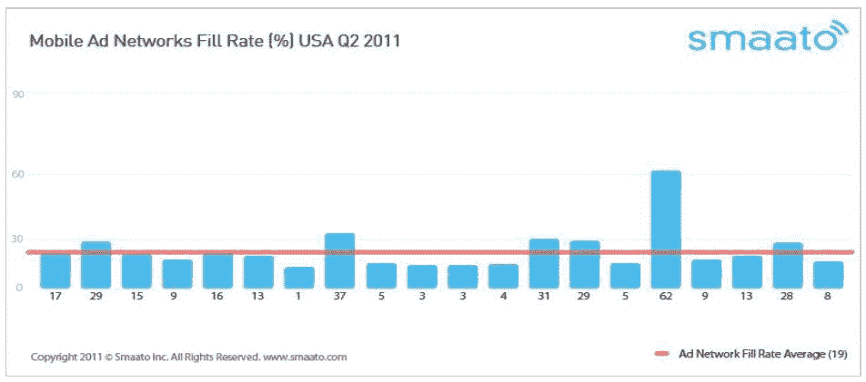

# 移动广告网络的填充率下降，Windows Phone 超过 CTRs 

> 原文：<https://web.archive.org/web/https://techcrunch.com/2011/09/19/mobile-ad-networks-fill-rates-drop-windows-phone-tops-ctrs/>

移动广告优化平台 Smaato 公司今天为 2011 年 Q2 发布了最新的移动广告[报告](https://web.archive.org/web/20230204224539/http://www.smaato.com/metricsq22011-2/)的结果。这些发现包括对移动广告采用率、填充率以及对移动广告网络表现的整体影响的观察。

Smaato 的移动度量报告基于 230 个国家的 8000 多万次广告请求和 60 多个连接的广告网络，发现广告库存的增长速度快于预算，导致广告填充率下降。

它还发现，Windows Phone 在美国和全球的点击率都领先于 iOS、Android、黑莓和 Symbian。

根据 Smaato 的数据，Q2 的全球平均广告网络填充率为 18%，比上一季度下降了 2%，同比下降了 3%。在全球 40 大广告网络中，填充率相差很大，从 3%到 58%不等。

在美国，前 20 大广告网络的填充率下降了 27%至 19%。20 人中只有 6 人的表现高于平均水平(在 28-62%之间)。)斯马托·CMO·哈拉尔德·尼德哈特说，当前的经济状况是填充率下降的一个因素，但它也表明了市场越来越分散。

尽管有这些下降，Smaato 发现从事专业化的网络看到了更大的回报，提供地理位置或视频等功能来增加更多价值。前 40 名中有 9 家移动广告网络的表现超过了 Smaato 指数的平均水平，尽管销量“相当”小，但比率从 23%到 58%不等。

在其平台对比中，Smaato 测量了所有设备的平均 CTR(点击率),并将这个数字设为 100。

Windows Phone (131)连续第二个季度在智能手机操作系统(OS)指数中领先，而 RIM (91)在全球性能指数中的广告表现超过了苹果(86)。诺基亚的 Symbian (114)比去年有所下降，而 Android (76)的性能提高了近 50%。

然而，在美国，智能手机平台的表现有所不同，Windows Phone (108)仅略高于苹果的 iOS (107)，但输给了 Android (89)。RIM 升至第三位，诺基亚的塞班落后。

Neidhardt 表示，随着基于安卓系统的低成本智能手机和新的安卓平板电脑在亚洲进入市场，安卓的广告前景将继续改善。“随着这一趋势的继续，我们将看到大品牌和广告商对 Android 平台的需求会更大，”他说，“因此，随着 Android 的继续激增，出版商和开发商的收入机会也会更多。”

本季度测量的最后一个指标是广告网络响应时间，全球前 10 大网络的响应时间在 39 到 328 毫秒之间。这意味着平均响应时间为 290 毫秒。

