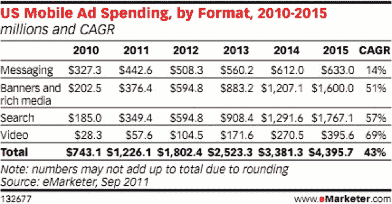

# 预计 2011 年美国移动广告支出将增长 65%，达到 12 亿美元 TechCrunch

> 原文：<https://web.archive.org/web/http://techcrunch.com/2011/10/04/mobile-ad-spending-65-percent-2011/>

# 2011 年，美国的移动广告支出预计将增长 65%，达到 12 亿美元

根据 eMarketer 的修正估计，今年移动广告支出预计将达到 12.3 亿美元，比 2010 年增长 65%。这一估计略高于 eMarketer 去年公布的 11 亿美元的数字。

对未来几年的估计也在上升。它们如下:

**移动广告支出**

2010 年:7.43 亿美元
2011 年:12 亿美元
2012 年:18 亿美元
2013 年:25 亿美元
2014 年:34 亿美元
2015 年:44 亿美元

这些数字包括展示、搜索、文本广告，甚至视频广告(这是增长最快的移动广告单元)。移动视频广告预计今年将产生 5760 万美元的收入，并以 69%的复合年增长率增长到 2015 年，届时预计将达到 3.956 亿美元。明年，由于应用广告的增长，移动显示和移动搜索将会势均力敌。2012 年，这两家公司的广告支出将达到近 6 亿美元。

