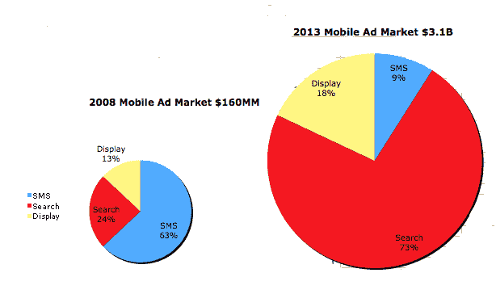

# 移动广告正在形成全搜索 

> 原文：<https://web.archive.org/web/https://techcrunch.com/2009/10/06/mobile-advertising-is-shaping-up-to-be-all-search/>

随着像 iPhone、Android、Blackberry 和 Palm 这样的网络手机的兴起(威瑞森的首席执行官说[其新手机销售的 40%](https://web.archive.org/web/20220930214823/http://www.beta.techcrunch.com/2009/10/06/is-verizon-more-open-than-apple-new-android-phones-will-support-google-voice/)是这样的智能手机)，移动广告有望成为一个巨大的增长领域。市场研究公司凯尔西集团(T4)预测，移动广告市场将从 2008 年的 1.6 亿美元膨胀到 2013 年的 31 亿美元。

当然，这只是一个有根据的猜测，最终会证明是错误的。但毫无疑问，四年后移动广告将会大得多，甚至可能是现在的 10 到 20 倍。所有的移动广告收入会流向哪里？在这里，我认为凯尔西集团更有针对性。根据花旗分析师马克·马哈尼最近发布的一份研究报告，预计移动搜索将从去年占整个移动广告市场的 24%上升到 2013 年的 73 %,这也是我获得所有这些数据的地方。

显示广告预计将从总广告的 13%上升到 18%，而短信广告的百分比将从 63%下降到 9%(见图表)。所以看起来搜索又一次成为了大赢家。难怪谷歌如此关注移动搜索，将其作为其主要增长来源之一。

想想吧。显示广告占据了你手机屏幕上宝贵的空间，往往会妨碍你的工作，让你觉得很烦。这就是为什么[大部分人不喜欢他们](https://web.archive.org/web/20220930214823/http://www.beta.techcrunch.com/2009/09/12/study-smartphone-particularly-iphone-users-less-likely-to-click-on-ads/)。但当你在手机上搜索时，你经常会在附近寻找一些东西——商店、餐馆、干洗店。你对广告更加开放，尤其是当它们与你的搜索相关的时候。

移动搜索特别适合本地搜索广告。马哈尼写道:

> 鉴于移动设备的特性，随着时间的推移，移动设备上的本地查询应该比桌面上的本地查询多。

事实上，凯尔西集团预测，到 2013 年，本地搜索将从 2008 年占所有移动搜索的 28%上升到 35%以上。本地搜索已经占到了移动搜索广告收入的一半。因此，仅仅对本地移动搜索而言，这就是四年内 12.7 亿美元的市场机会。

那么，你更愿意成为哪一个:谷歌或一些随机的移动广告网络将显示广告塞进应用程序和移动浏览器？