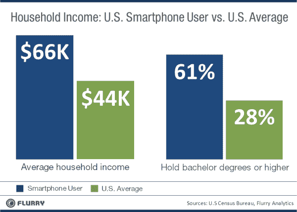
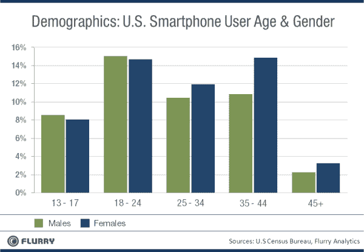

# 移动应用库存有望在年底赶上在线展示广告支出 

> 原文：<https://web.archive.org/web/http://techcrunch.com/2011/08/31/mobile-app-inventory-on-track-to-match-online-display-ad-spend-by-year-end/>

# 移动应用库存有望在年底赶上在线展示广告支出

移动应用分析公司 [Flurry](https://web.archive.org/web/20230205012936/http://www.flurry.com/index.html) 发布了一份[新报告](https://web.archive.org/web/20230205012936/http://blog.flurry.com/bid/71285/Mobile-App-Inventory-Hungry-Enough-to-Eat-Internet-Display-Ad-Spend)比较了美国移动应用库存和传统互联网展示广告支出，结果令人印象深刻。该公司表示，根据 Flurry 网络上超过 100，000 个移动应用程序的数据，假设目前的趋势继续下去，到 2011 年底，应用程序库存将吸收相当于美国在线展示广告支出的金额。

形象化这一趋势的最佳方式是用[的图表 Flurry 提供的](https://web.archive.org/web/20230205012936/https://techcrunch.com/wp-content/uploads/2011/08/usappinventory_vs_usonlinedisplayadspend-resized-600.png)。

你可以看到，在过去的两年里，“移动应用程序库存增长如此迅猛，现在可以满足一个成熟的、15 年前的在线广告形式的需求，”该分析公司表示。

为了得出这些数字，Flurry 追踪了每个时段显示的平均广告数量，为 4.3 个。平均应用程序会话时间为 4.2 分钟。相比之下，平均网站会话长度不到 1 分钟。Flurry 随后查看了其网络上的会话数量。该公司跟踪了市场上约 20%的所有会话，因此它增加了这些数据以得出市场规模，并将这些数据与美国展示广告的净支出进行对比。

它还假设移动应用程序库存的 CPM(每 1000 次展示的成本)为 2.50 美元，该公司称这是“保守的”

Flurry 表示，由于智能手机、出版商和会话使用的增长，以及越来越多的出版商在其应用程序中集成广告，市场增长如此之快。后一项也可能与 Android 市场份额的增加及其主要由广告支持的应用生态系统有关，尽管 Flurry 在报告中没有提到这一特定因素。

**移动广告瞄准有吸引力的人群**

利用美国人口普查局的数据，Flurry 还发现，由于家庭收入水平和教育成就水平较高，智能手机用户对广告商具有吸引力。应用程序用户更有可能更年轻，也更倾向于女性。

