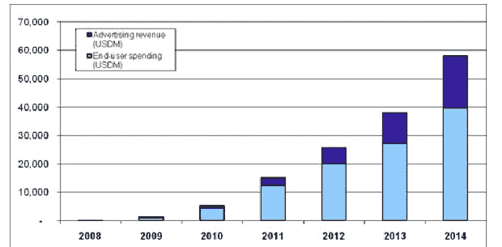

# Gartner 预测 2011 年移动应用商店收入将达到 150 亿美元 

> 原文：<https://web.archive.org/web/https://techcrunch.com/2011/01/26/mobile-app-store-15-billion-2011/>

# Gartner 预测 2011 年移动应用商店的收入将达到 150 亿美元

移动应用有多大？在一份新的报告中，市场研究公司 [Gartner](https://web.archive.org/web/20221021151604/http://www.gartner.com/) 预测，2011 年全球移动应用商店的收入将从去年的 52 亿美元增长到 150 亿美元，并将持续增长到令人震惊的 580 亿美元。正如对高速增长市场的任何预测一样，你可以肯定的是，这一预测将在六个月内发生变化，你走得越远，涉及的猜测就越多。(记住，不到一年前[甚至没有人能够预测](https://web.archive.org/web/20221021151604/https://beta.techcrunch.com/2011/01/19/nobody-predicted-ipad-growth/)今年*会卖出多少台 iPads】)。但是这里有一个你可以信赖的预测:在更好的预测出现之前，你一整年都会听到这些数字。*

Gartner 将预测分为广告收入和付费下载(包括应用内购买)，如上图所示。付费下载和其他直接购买构成了预期收入的大部分，但随着时间的推移，移动广告有望发展成为一个数十亿美元的市场。

该预测包括所有的移动应用商店，而不仅仅是苹果的(如安卓市场、诺基亚的 Ovi 商店、Research In Motion 的应用世界、微软市场和三星应用)。然而，Gartner 估计，苹果的应用商店占了去年 82 亿总下载量(包括免费和付费)的 90%，并将继续占据主导地位。2011 年，Gartner 估计应用商店总下载量将达到 177 亿，其中 81%是免费的。收入预测包括苹果和其他应用商店保留的部分。