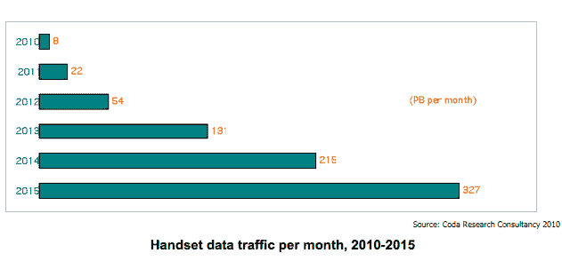

# 未来五年，移动数据流量预计将增长 40 倍

> 原文：<https://web.archive.org/web/https://techcrunch.com/2010/03/30/mobile-data-traffic-rise-40-fold/>

# 未来五年，移动数据流量预计将增长 40 倍

随着像 iPhone 和 T2 这样的智能手机接管移动网络，通过蜂窝网络的数据流量预计将在未来五年增长 40 倍。英国 Coda 研究咨询公司预测，仅在美国，手机数据流量将从今年的每月 8pb 增长到 2015 年的每月 327。这相当于 117%的复合年增长率。

大量数据将以移动网络浏览的形式出现，预计最大的贡献者将是移动视频。到 2015 年，移动视频将占美国所有移动数据使用量的 68.5%(或每月 224)。Coda 估计，在未来五年内，美国 1.58 亿移动互联网用户中，将有 9500 万移动手机用户通过手机观看视频。

到 2015 年，移动数据收入(不包括短信费用)预计将占运营商所有数据收入的 87%。但 Coda 的联合创始人史蒂夫·史密斯预测，除非他们采用分级定价，否则他们将很难跟上需求。习惯了从手机上随时随地访问数据的消费者会发现这毫无吸引力。但是运营商必须想办法支付大规模网络升级的费用。Coda 估计，如果运营商今天冻结他们的网络，他们将在 2012 年达到 100%的峰值利用率，届时 40%的手机将是智能手机。

下表显示了 Coda 对美国移动互联网用户数量以及智能手机和功能手机的移动数据流量比例的更多预测:

|   | 2010 | 2011 | 2012 | 2013 | 2014 | 2015 |
| 通过手机的移动互联网用户 | 84M | 100 米 | 113 米 | 128 米 | 145 米 | 158 米 |
| 智能手机流量占手机流量的百分比 | 79% | 90% | 95% | 97% | 98% | 98% |
| 功能电话流量占手机流量的百分比 | 21% | 10% | 5% | 3% | 2% | 2% |