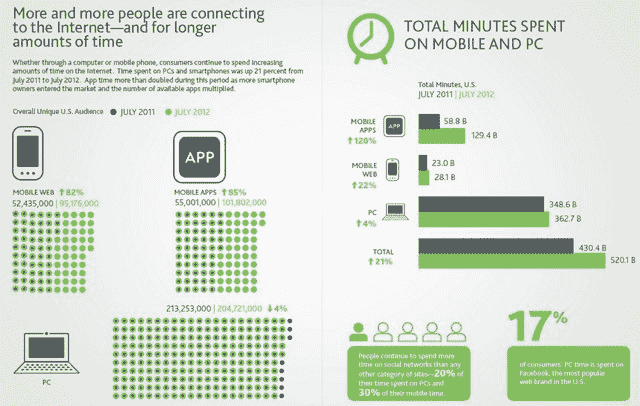

# 移动设备推动 2012 年社交媒体的采用:应用和移动网络占增长的大部分；近一半的社交媒体用户通过智能手机访问网站 

> 原文：<https://web.archive.org/web/https://techcrunch.com/2012/12/03/mobile-drives-adoption-of-social-media-in-2012-apps-mobile-web-account-for-majority-of-growth-nearly-half-of-social-media-users-access-sites-on-smartphones/>

调查公司尼尔森和 [NM 煽动](https://web.archive.org/web/20221007042005/http://www.nmincite.com/)，尼尔森和麦肯锡的合资企业，今天[发布了](https://web.archive.org/web/20221007042005/http://blog.nielsen.com/nielsenwire/global/social-media-report-2012-social-media-comes-of-age)2012 年社交媒体生态系统的全面状况。该报告发现，消费者现在大约有 20%的时间通过个人电脑使用社交网络，30%的时间通过手机访问社交网络。此外，2012 年 7 月，美国社交媒体在这两个平台上花费的时间增长了 37%，达到 1210 亿分钟，高于 2011 年 7 月的 880 亿分钟。

移动设备有助于这些数字的增长，消费者**使用社交媒体移动应用和移动网站的时间占同比增长的 63%。**46%的社交媒体用户表示他们使用智能手机访问社交媒体，16%的用户表示他们在平板电脑上使用社交媒体。

关于移动对消费者在线时间增加的影响，我们可以看到这样一个事实，即美国移动网络受众整体上升了 82%(2011 年 7 月至 2012 年 7 月)，应用程序受众上升了 85%，而 PC 受众同期下降了 4%。

就使用这些平台的总时间而言，移动应用增长了 120%，移动网络增长了 22%，PC 使用增长了 4%。

**社交媒体的使用**

毫不奇怪，脸书是美国访问量最大的社交网络，有 1.522 亿人通过 PC 访问，7840 万人使用移动应用程序，7430 万人使用移动网站。当然，请记住，同一用户可能在任何时候使用这三个渠道中的任何一个访问脸书，所以你不能简单地将这些数字相加来了解脸书在美国的吸引力。

谷歌的 Blogger 是第二大最受欢迎的社交网络(5850 万)，其次是 Twitter(3700 万)，但该报告也指出，Pinterest 在 2012 年出现了大幅增长，其独立受众和花在个人电脑、移动网络和移动应用程序社交网络上的时间同比增长最快(增长 1047%，达到 2720 万)。

Pinterest 在今年的报告中受到了特别关注，对其不断增长的受众进行了更深入的研究，这些受众通过 PC 在该网站上花费了 1，255，225，000 分钟，通过移动应用程序花费了 120，486，00 分钟，通过移动网络花费了 720，973，00 分钟。该网络仍然在很大程度上偏向女性，70%的 PC 用户、84%的应用程序用户和 72%的移动网络用户是女性。

社交媒体格局的另一个变化是所谓的“第二屏幕”的持续增长，即通过在看电视的同时使用智能手机或平板电脑，将看电视变成一种更具社交化的体验。该报告发现，截至 2012 年 6 月，超过 33%的推特用户在推特上发布了与电视相关的内容。此外，美国 44%的平板电脑用户和 38%的智能手机用户每天在看电视的同时使用他们的设备访问社交媒体。在其他地区，这一趋势甚至显示出更高的吸引力:超过 50%的拉丁美洲用户在看电视时与社交媒体互动；在中东和非洲，超过 60%的人这样做了。

对于营销人员来说，尼尔森和 NM inspire 警告说，消费者对社交媒体和广告的态度仍在演变。三分之一的社交媒体用户表示，他们发现社交网络上的广告比互联网上其他地方的广告更令人讨厌。但另一方面，超过四分之一的人表示，他们更有可能关注社交媒体上分享的广告。另有四分之一(+)的人表示，在社交媒体网站上看到根据个人资料定制的广告是可以的。

消费者对社会关怀的想法分歧较小，即通过社交媒体提供客户支持。平均而言，47%的用户参与社会关怀，其中 70%的用户每月参与一次。三分之一的人表示，比起通过电话联系公司，他们更喜欢社交媒体。

关于这个话题和其他话题的更多数据可以在[完整报告](https://web.archive.org/web/20221007042005/http://blog.nielsen.com/nielsenwire/social/)中找到，现在出来了。

