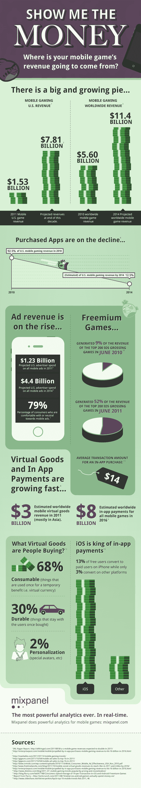

# 手机游戏可能正在起飞，但它们的创作者打算如何赚钱？[信息图 TechCrunch

> 原文：<https://web.archive.org/web/https://techcrunch.com/2011/11/14/mobile-games-may-be-taking-off-but-how-are-their-creators-going-to-make-money-infographic/>

# 手机游戏可能正在起飞，但它们的创作者打算如何赚钱？[信息图]

移动游戏越来越大。你听过一次，你听过一千次。[日本的移动、社交游戏巨头正在扼杀它](https://web.archive.org/web/20230205105113/https://techcrunch.com/2011/10/31/dena-gree-japan/)；Android 和 iOS 游戏[现在创造的收入超过了任天堂和索尼所有便携式游戏的总和](https://web.archive.org/web/20230205105113/https://techcrunch.com/2011/11/09/flurry-android-and-ios-games-beat-nintendo-and-sony-in-revenue/)；游戏是美国[最受欢迎的移动应用类别](https://web.archive.org/web/20230205105113/http://blog.nielsen.com/nielsenwire/online_mobile/games-most-popular-mobile-app-category/)

此外，据《纽约时报》援引 Gartner 的报道称，到 2015 年，与游戏相关的支出将达到 1120 亿美元(预计今年将超过 740 亿美元，高于 2010 年的 670 亿美元)，到 2015 年，手机游戏预计将在游戏平台中占 20%的份额。预计在此期间，手机将是所有平台中增长最快的。

万岁！？这一切都很好，但问题仍然存在:如果人们越来越多地选择免费应用而不是付费应用(Distimo 的数据显示，今年游戏的平均售价下降了 28%)，移动游戏开发商将如何赚钱？在接下来的 5 年里，移动游戏的收入将来自哪里，游戏创作者将如何赚钱？

得益于实时分析服务 Mixpanel 的一张漂亮的信息图，未来手机游戏的大部分收入将来自手机广告和应用内支付。

据 Distimo 称，游戏内虚拟货币目前是应用内货币化的最重要驱动力之一，300 款最受欢迎的免费游戏中有 35%使用某种形式的虚拟货币在应用商店中货币化。

然后是移动广告，随着游戏开发商和广告网络利用玛丽·米克尔在她最新的互联网趋势报告中发现的 200 亿美元的机会，移动广告无疑将继续飙升。美国人花 8%的时间在手机上使用媒体，但只有 0.5%的广告商的总广告支出是针对手机的。

随着这种结构性转变的继续，以及围绕广告个性化的技术发展，游戏开发商将能够越来越多地依赖广告作为一种货币化形式。

免费增值模式变得越来越受欢迎，正如你将在下面的数据中看到的，但是当移动广告变得越来越成熟时，也有激励安装的货币化模式。这种奖励用户下载移动应用程序以换取二次奖励的方式，通常是免费的游戏内虚拟货币或商品，肯定有一定的潜力。当事情变得缓慢时，激励性流量可以是一个有意义的选择，有机地构建流量，投资回报就在那里。但是仍然有人怀疑激励安装的有效性，正如你在 Sarah 的文章中看到的。

有利的一面是，手机游戏有巨大的市场，如果你是一名游戏开发者，从他们的游戏中赚钱的方式越来越多。有些将被证明比其他更有价值，但下面是 Mixpanel 对我们在进化中所处位置的快照:

【T2

[摘自 Dotsauce.com 的图片](https://web.archive.org/web/20230205105113/http://www.dotsauce.com/2010/08/09/age-of-virtual-currency/)