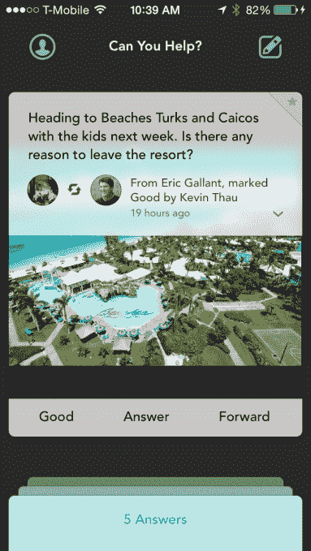
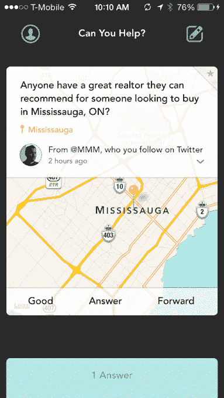
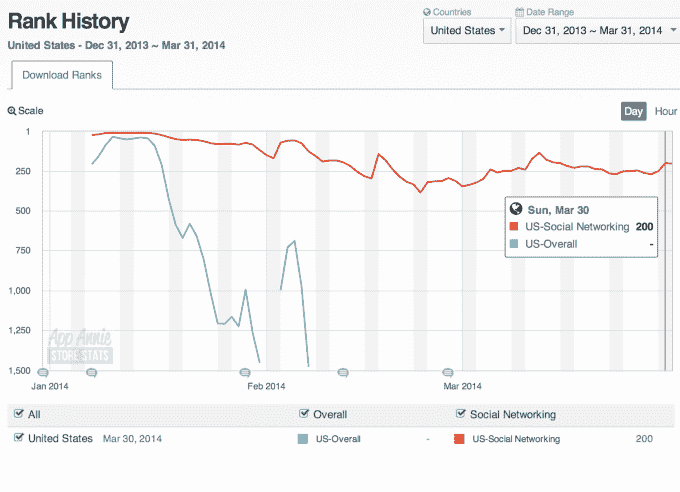

# 手机问答应用 Jelly 现在允许你向附近的用户提出基于位置的问题 TechCrunch

> 原文：<https://web.archive.org/web/https://techcrunch.com/2014/03/31/mobile-qa-app-jelly-now-lets-you-ask-location-based-questions-routed-to-nearby-users/>

虽然 Twitter 联合创始人比兹·斯通的移动 Q 应用 Jelly 的光芒和新奇感很快就消失了，但该公司继续迭代其产品——基于图片的搜索服务，让你可以向你的朋友和扩展网络询问这种问题，在这种问题上，个人意见的注入比谷歌上的一系列链接更有价值。

今天，该公司推出了 Jelly 的更新，通过添加使用地图和位置询问任何地方的能力，改变了人们提问的方式。该应用程序然后将这些问题发送给附近的用户。

以前，Jelly 只提供用照片来补充帖子的提问功能，这鼓励人们就他们看到的东西提出问题。这有时会导致荒谬的“这是什么？”键入问题，发帖人清楚地知道答案，只是用有问题的照片戏弄社区。

但与特定地点相关的问题在 Jelly 上越来越受欢迎，人们在这里询问旅游热点，附近的餐饮、购物或娱乐场所(例如，像一个懒人的 Yelp)，这与居住在该地区的人更相关。随着今天的更新，这款应用似乎将迎合这种以位置为中心的用例，同时仍然支持之前推出的基于照片的消息传递。

事实上，Jelly 也对后者进行了改进，因为它的图像搜索功能现在会自动建议你在帖子中使用照片，如果你没有分享相机胶卷中的照片的话。今天，当你开始问你的问题时，Jelly 提供了三个选择之一:用你的相机问，问任何地方，或者问任何你想问的问题。

Jelly 的要点，包括新的基于地图的功能，并不是说你不能在其他地方得到答案列表(例如附近的咖啡店，销售给定产品的零售商，等等。)，这是关于从你的朋友和他们的朋友那里获得个人意见，以及问谷歌搜索或现在的地图搜索所不能提供的问题的灵活性。

例如，分享基于地图的问题的用户发布了一些问题，比如在某个地方度假时做什么最好，或者一年中是否有更好的时间去某个特定的城市旅行，或者附近是否有公寓出租。

简而言之，前提是问题和答案在本质上应该是对话式的，同时也要对那些答案不确定但有争议的问题做出回应。最终，包括 Jelly 在内的大多数问答服务都希望找到一种方法来主宰谷歌搜索结果的长尾——这需要时间来实现。

围绕 Jelly 出现了一些反弹，可能是因为联合创始人斯通在推出之前过度销售和过度宣传了这款应用，将其描述为“让世界变得更有同情心”的工具，这对于问答服务来说有点过于热情，过于深远。当然，这很方便，但不会改变世界。

这款应用勉强保住了 iTunes 社交网络前 200 名的位置，这促使一些人，如 Valleywag 等[，在推出三个月后宣布该应用失败。(我们自己的约翰·比格斯](https://web.archive.org/web/20221005162326/http://valleywag.gawker.com/can-we-call-jelly-a-failure-yet-1550545779)[在我们的 TCTV 视频系列“飞或死”中也给了杰利一个激烈的“死](https://web.archive.org/web/20221005162326/https://beta.techcrunch.com/2014/03/09/fly-or-die-jelly/)”。

但 Jelly 有资金(通过 B 轮融资，金额未披露)，因此有时间尝试解决问题。在将产品功能与其用户群实际参与服务的方式相匹配方面，增加基于位置的问题和路由是第一批值得注意的步骤之一。重新设计的应用程序在 iTunes 上是[这里是](https://web.archive.org/web/20221005162326/https://itunes.apple.com/us/app/jelly/id685652528?mt=8)。([安卓版本](https://web.archive.org/web/20221005162326/https://play.google.com/store/apps/details?id=com.jellyhq.starfish)尚未更新)。