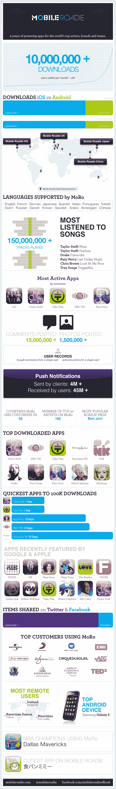

# Mobile Roadie 为中国带来自助式移动应用开发平台 

> 原文：<https://web.archive.org/web/https://techcrunch.com/2011/09/13/mobile-roadie-brings-self-service-mobile-app-development-platform-to-china/>

# Mobile Roadie 将自助式移动应用开发平台引入中国

[Mobile Roadie，](https://web.archive.org/web/20230205043530/http://www.mobileroadie.com/)允许任何人开发和创建时尚、丰富的媒体 [iPhone](https://web.archive.org/web/20230205043530/https://techcrunch.com/2009/04/20/mobile-roadie-builds-bands-custom-iphone-apps-on-the-cheap/) 和 [Android](https://web.archive.org/web/20230205043530/https://techcrunch.com/2010/02/22/mobile-roadie-now-creates-apps-for-android-ecosystem/) 应用程序，今天在中国发布。

Mobile Roadie 提供了一个自助式应用开发平台，集成了 YouTube、Brightcove、Flickr、Twitpic、Ustream、Topspin、Google News、RSS、Twitter 和脸书。用户可以开发 iOS 和 Android 应用，该公司已经在英国、法国、西班牙、澳大利亚、意大利、德国、巴西、土耳其和日本开展业务。

Mobile Roadie 认为这一推出尤为重要，因为这是利用中国庞大的移动用户群的机会。这家初创公司表示，由于这种增长，DIY 应用程序创建平台具有巨大的潜力。Mobile Roadie 正在与中国移动机构 FabriQate 合作，将帮助向中国市场提供本地化版本的 Mobile Roadie 平台。该公司表示，中国是他们迄今推出的最大的手机市场

例如，麦当娜的粉丝现在可以下载她为中国市场设计的官方应用程序。在她的应用程序中，中国粉丝可以听歌曲，查看照片和视频，在粉丝墙上与其他粉丝互动，并在中国社交网络微博和人人网上分享他们的活动。

迄今为止，该公司的应用程序已有 1000 万次下载。客户包括麦当娜、泰勒·斯威夫特、凯蒂·佩里、达拉斯小牛队、迈阿密海豚队、世界经济论坛、哈佛法学院和永利拉斯维加斯。Mobile Roadie 还[为](https://web.archive.org/web/20230205043530/https://techcrunch.com/2009/12/03/mobile-roadie-partners-with-ustream-to-power-official-iphone-app-for-leweb/) [LeWeb、](https://web.archive.org/web/20230205043530/http://www.leweb.net/)开发了官方 iPhone 应用程序，与兰登书屋达成协议[为作者开发 iPhone 应用程序，与](https://web.archive.org/web/20230205043530/https://techcrunch.com/2009/12/21/mobile-roadie-random-house-parnter/)[索尼音乐](https://web.archive.org/web/20230205043530/https://techcrunch.com/2011/01/20/mobile-roadie-and-sony-partner-to-launch-mobile-apps-for-music-artists/)为音乐品牌的艺术家网络开发移动应用程序。

