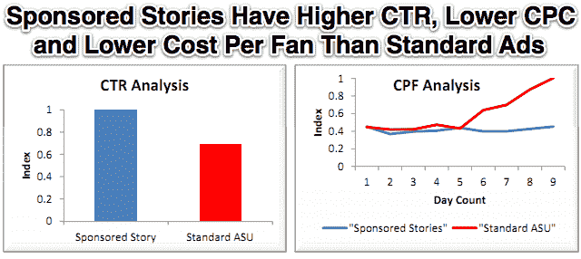

# 有证据支持脸书计划通过赞助故事新闻提要广告将移动业务货币化 

> 原文：<https://web.archive.org/web/https://techcrunch.com/2011/12/13/mobile-sponsored-stories/>

接近脸书广告团队的消息人士告诉我，该公司可能首次开始在其移动应用和 HTML5 网站上显示广告。广告将以移动新闻源赞助故事的形式出现——显示朋友与品牌互动的社交广告，而不是不适合移动屏幕的传统显示广告。[彭博新闻](https://web.archive.org/web/20230207224632/http://www.bloomberg.com/news/2011-12-13/facebook-is-said-to-ready-its-first-foray-into-mobile-ads-by-end-of-march.html)今天早些时候发表了关于从未公开来源收到类似信息的报道。一周前，当我问脸书的广告代表 Brandon McCormick 关于移动新闻源赞助故事的潜力时，他害羞地告诉我“我认为那会很有趣。”

这一阴谋的更多证据是:脸书已经开始在其网站的自动收报机中显示赞助的故事，可能是为了测试反弹。此外，脸书最近将一种广告类型从赞助故事中解密，以确保它们都需要用户操作。这一战略可能会为脸书打开一个新的主要收入来源，为潜在的[1000 亿美元 IPO](https://web.archive.org/web/20230207224632/https://techcrunch.com/2011/11/28/ipo-risks/) 做准备。

两周前，我开始听说，通过手机，脸书可能会在主要新闻提要中加入广告——这是它从未做过的事情。当我问 McCormick 脸书是否会走这条移动货币化的道路时，他告诉我“这是为了让移动体验变得非常好，然后我们会想办法赚钱。我们想要一个对人们有用的解决方案，我们不希望它被打断，但我们希望它对广告商有效。”

这听起来像是赞助的故事，考虑到 5 月份进行的一项研究显示,[社交广告的点击率高 46%](https://web.archive.org/web/20230207224632/http://www.insidefacebook.com/2011/05/03/sponsored-stories-ctr-cost-per-fa/)而点击费用低 20%。这表明它们对观众和广告商都有吸引力。

只有允许移动端的赞助报道，才能防止广告商注入不相关的内容，从而严重污染新闻源。赞助报道则不同，因为它们显示的内容可以有机地出现在新闻提要中，比如朋友喜欢某个品牌的页面、登记入住某个地方或使用某个应用程序。品牌广告客户付费以保证这些故事的可见性，但首先必须通过吸引真实的用户互动来引发它们。

因为赞助故事实际上包括了朋友的活动，它们不太可能激怒脸书历史上爱发牢骚的用户群。上个月，赞助新闻开始出现在脸书网站界面右侧的二级自动收报机中，几乎没有用户抗议的迹象。随着脸书从其 HTML5 网站上为其本地移动 iPhone 和 Android 应用程序提供新闻源，它只需开始在其移动网站的新闻源上显示赞助故事，就能让它们每天覆盖数亿用户。

在 9 月份之前，广告商可以为“Page Post”赞助的故事付费，让他们的页面更新在现有粉丝中获得更多的可见性。然而，由于这些广告不要求朋友采取行动，[脸书将这种广告单元类型从赞助故事中移除，并将其重命名为“赞助页面帖子”](https://web.archive.org/web/20230207224632/http://www.insidefacebook.com/2011/09/26/sponsored-stories-tracking-tags-page-post-selection/)。这种微妙的变化可能会为移动新闻源赞助的故事铺平道路，这些故事总是包括朋友的行为，因此迫使品牌专注于推动参与，而不仅仅是花钱。

目前还不清楚广告客户是否可以选择在手机上展示他们的赞助故事，或者脸书是否会在网络和手机上进行分配。无论哪种方式，移动新闻源赞助的故事都可能成为脸书的巨大收入来源，因为预计 2012 年美国移动广告支出将达到 18 亿美元。

迄今为止，脸书一直保持移动广告免费，以推动广泛采用，特别是在发展中国家，那里的用户增长潜力仍然很大。但它也可能一直在等待，直到不引人注目的赞助故事准备好移动部署。自从其移动应用和网站推出并增长到占该网站每日活跃用户的一半以来，脸书一直在储备盈利潜力。该公司可能计划在 IPO 之前宣布这一新的收入来源，以提高投资者的兴趣。不过，现在秘密已经泄露，二级市场的股价可能会相应上涨。