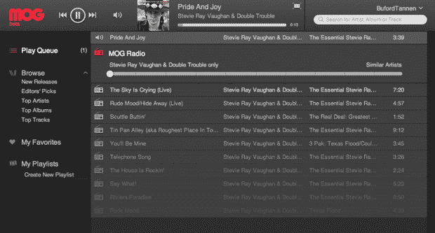

# MOG 推出漂亮的 HTML5 播放器，新重点是推荐和播放列表 

> 原文：<https://web.archive.org/web/http://techcrunch.com/2011/06/30/mog-rolls-out-slick-html5-player-with-a-new-emphasis-on-recommendations-and-playlists/>

在线音乐竞赛现在是一场全力冲刺:亚马逊、谷歌和苹果现在都在提供(或准备推出)让你将音乐收藏上传到云端的服务，让你无论在哪里都能听到自己的音乐。但他们不仅仅是相互竞争——另一组服务包括 MOG、Rdio 和(最终)Spotify，让用户以每月 10 美元左右的合理费用，随时随地播放任何 T2 歌曲。

越来越有趣了。今天， [MOG](https://web.archive.org/web/20230203070717/http://www.mog.com/) 让这场比赛更加接近了。

该服务刚刚向用户推出了一款新的测试版播放器，简化了 MOG 的体验，比之前的版本更加强调建立播放列表和推荐。

到目前为止，MOG 用户一直使用基于 Flash 的弹出播放器——你在主浏览器窗格中浏览网站，一边浏览一边添加歌曲，这些歌曲会添加到你的播放列表中，你可以在较小的弹出窗口中控制播放列表。它运行良好，但与采用更像 iTunes 的界面的服务相比，它可能有点令人困惑。

新玩家解决了这个问题。任何在 Chrome 网络商店上使用过 MOG web 应用的人都会对它很熟悉，该应用于 12 月推出(它是该播放器的变体)。但它包括一些关键的附加功能，并且它也作为测试版选项向所有 MOG 用户推出(以前唯一的访问方式是通过 Chrome 商店，许多人不知道这一点)。

实际上，新播放器的功能比旧款少——例如，它缺少评分和查看其他用户资料的功能。但是，除了更直观和更快的 HTML5 界面，它还增加了可能更重要的功能:即推荐和更好的播放列表创建。

现在，当你登录新版 MOG 时，该服务会查看你的脸书赞(以及你朋友的赞)，立即开始推荐艺术家。我登录了一个测试账户，里面有一些我最喜欢的乐队，果然，服务马上给我提供了《黑暗》和史蒂夫·雷·沃恩的专辑。

MOG 首席执行官大卫·海曼说，在整合这一功能时，该团队实际上得到了脸书的一些帮助。海曼对传闻中的脸书音乐计划只字未提，只是说他“希望在未来与他们一起做更多伟大的事情”。

MOG 和其他吃到饱的音乐服务越来越多地在速度、推荐和社交分享等功能上展开竞争，而不是在图书馆的规模上。MOG 已经提供了可靠的移动应用程序，这次更新使桌面体验明显更加引人注目，特别是对于新用户来说，他们现在看到的是个性化的主页，而不是流行音乐的通用列表。

