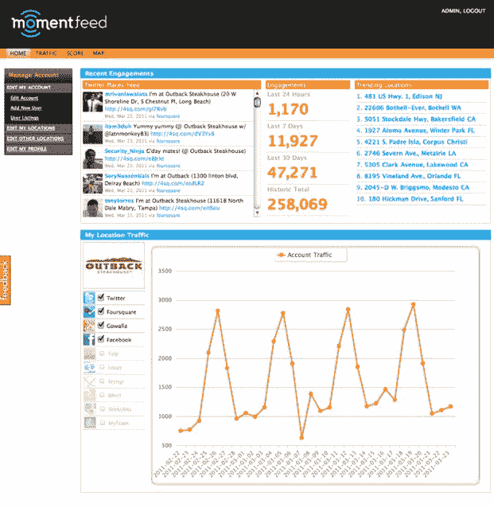

# MomentFeed 获得 120 万美元种子资金，帮助企业按位置管理特价商品 

> 原文：<https://web.archive.org/web/http://techcrunch.com/2011/07/11/momentfeed-1-2-million-location/>

# MomentFeed 获得 120 万美元的种子资金，帮助企业按位置管理特价商品

基于地理位置的营销刚刚起步，当地企业正在摸索如何最好地使用 Foursquare、脸书广场、Gowalla 甚至 Twitter 等服务。如果你只有一家店，那就够难的了。对于连锁店和全国性零售商来说，管理 400 家商店的 Foursquare 特价商品是一场噩梦。 [MomentFeed](https://web.archive.org/web/20230203101655/http://momentfeed.com/) 正试图通过一个基于位置的营销仪表板，为拥有多个位置的企业带来一些秩序和分析。

这家总部位于洛杉矶的初创公司刚刚从 DFJ·边疆、DFJ·JAIC、Factual 创始人吉尔·埃尔巴兹、Rapleaf 创始人奥伦·霍夫曼和沃尔特·科特查克那里筹集了 120 万美元的种子资金。

MomentFeed 从 Foursquare、脸书、Twitter 和 Gowalla 获取商家位置数据，并为零售商提供全国各地所有入住、交易和特价商品的统一视图。(它也建立在 Factual 的位置数据上，这有助于协调服务之间的位置)。通过一个仪表板，像 7-Eleven 这样的零售商或快餐连锁店可以看到，也许更多的人在纽约的 Foursquare 上登记，但在中西部的脸书 Places 上登记，并相应地调整他们的目标。“我们建立在位置信号上，而不是以关键词作为主要信号，”首席执行官罗布·里德说。

这家初创公司提供分层服务，从分析到活动管理到 CRM，每个地点每年的成本在 29 美元到 99 美元之间。目前还不清楚在 Foursquare 和其他服务上运行特价商品将向哪些商家收取费用，但 Reed 预计将与每项位置服务分享收入。“我们很高兴与 Foursquare 和其他公司分享数据收入，”他说，“就像 Twitter 与 DataSift 一样。”(DatSift 也[在 600 万美元的首轮融资中筹集了资金](https://web.archive.org/web/20230203101655/https://techcrunch.com/2011/07/11/datasift-6-million/)。

