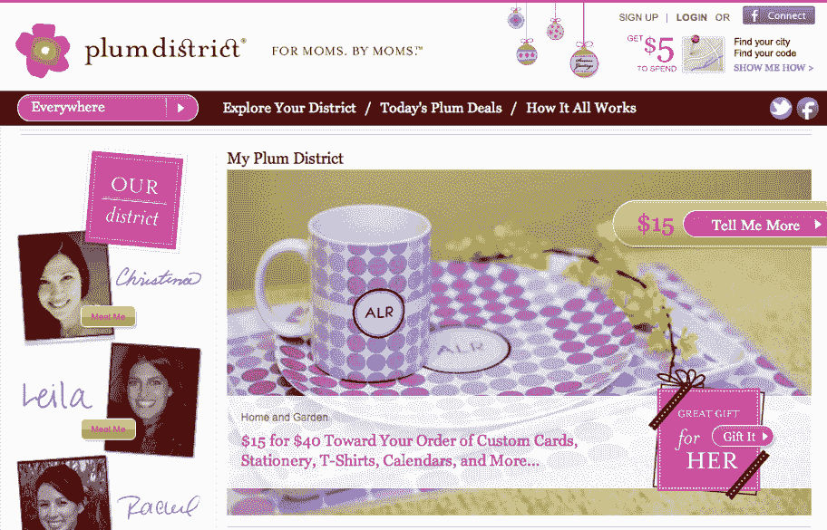

# 妈妈们喜欢日常交易:Plum District 筹集了 2000 万美元，收购了 Chatterfly & DoodleDeals TechCrunch

> 原文：<https://web.archive.org/web/https://techcrunch.com/2011/12/08/moms-love-daily-deals-plum-district-raises-20-million-acquires-chatterfly-doodledeals/>

妈妈们的日常交易网站 Plum District 今天宣布，它已经完成了由 General Catalyst Partners 领投的 2000 万美元 C 轮融资，使其融资总额达到 3000 万美元。

该公司还宣布收购了另外两家初创公司:新推出的移动忠诚度平台 [Chatterfly](https://web.archive.org/web/20230117172616/http://www.crunchbase.com/company/chatterfly) 和一个直接竞争对手 [DoodleDeals](https://web.archive.org/web/20230117172616/http://www.crunchbase.com/company/doodledeals-inc) ，这是一个为父母提供的日常交易服务。

C 轮融资还吸引了现有投资者 Kleiner Perkins Caufield & Byers 以及新投资者 Comcast Ventures 和杜克大学的参与。此外，Plum District 还与 Walmart.com 前总裁兼首席执行官劳尔·瓦兹奎高调合作，后者已在 Plum 董事会任职六周。

Plum District 首席执行官梅根·加德纳(Megan Gardner)表示，C 轮融资的额外资金被用于扩大妈妈们和当地商家之间的关系。

为了实现这一目标，普拉姆区将利用从 Chatterfly 新获得的技术，特别是其邻里奖励计划。你可能还记得 Chatterfly 今年夏天推出的，它推出了一个移动的数字系统来取代旧的纸质打孔卡系统。通过 Chatterfly 的系统，企业可以奖励顾客在他们的商店购物，也可以奖励他们在脸书、Twitter、Foursquare 和 Google+等社交网络上分享经验。

这种人工口碑广告系统非常适合以妈妈为中心的 Plum District，该地区使用“地区顾问”——妈妈们与当地商家合作，为他们指定的地区制定定制的营销计划。目前，Plum District 的所有交易都直接来自这些妈妈/员工。加德纳说，她的公司一直致力于自己的移动忠诚度解决方案，但发现与 Chatterfly 有很大的联系。

忠诚度已经是 Plum District 的一大重点，通过社交网络进行病毒式分享也是如此。事实上，Gardner 指出，75%的 Plum District 用户通过脸书、Twitter 或电子邮件分享了交易。现在，该公司正在将自己的技术与 Chatterfly 的结合起来。新系统正在奥兰治县、东湾区和北卡罗来纳州的罗利进行测试

但是这些收购不仅仅给普拉姆区带来了新技术，也带来了更广阔的市场。例如，通过收购总部位于纽约的 DoodleDeals，Plum Deals 能够增强其在东海岸的影响力。加德纳承认涂鸦交易在纽约有很强的影响力。“他们先到那里，我们一直在远处欣赏他们，”加德纳承认道。

目前，Plum District 雇佣了 300 名 mom 顾问，在美国 27 个市场(70 个地区)开展业务。通过收购，这些将保持不变，但普拉姆区在七个关键市场的存在将得到加强。它还将增加到 90 名全职员工和 300 名“地区顾问”

此外，收购 DoodleDeal 意味着获得该服务的独家分销合作伙伴关系，包括与 Time Out New York Kids、What to Expect 和亚马逊的 Diapers.com 的合作伙伴关系，所有这些都将继续进行 Plum 交易。

PlumDistrict 现在拥有近 100 万用户，迄今为止已经完成了 1 万多笔交易。

*更正:之前已输入 10 M 以上。*