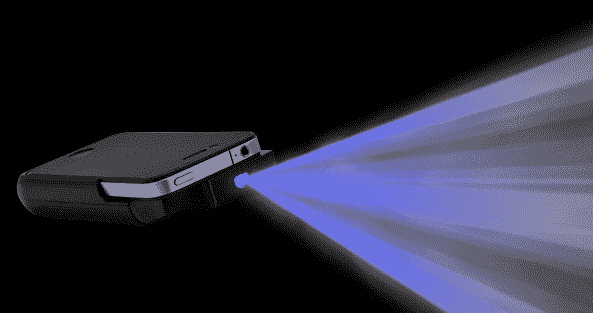
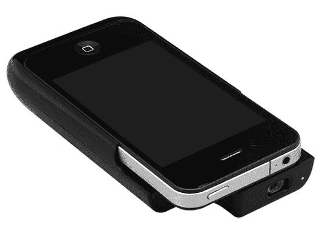
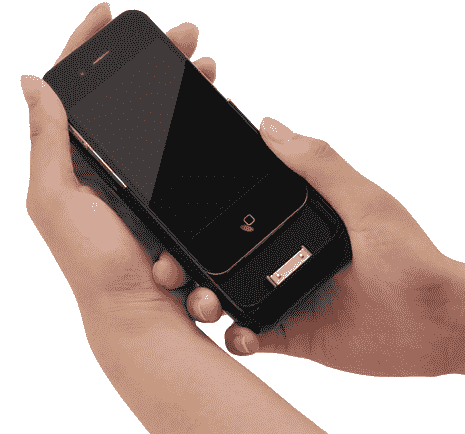
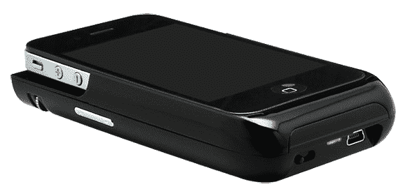

# 整体:iPhone 4 外壳+袖珍投影仪+电池合二为一 TechCrunch

> 原文：<https://web.archive.org/web/https://techcrunch.com/2011/10/14/monolith-iphone-4-case-pocket-projector-battery-rolled-into-one/>

# 独石:iPhone 4 外壳+袖珍投影仪+电池合二为一

一家名为 [Century](https://web.archive.org/web/20230205014223/http://www.jpcentury.com/index.aspx) 的日本配件制造商今天开始销售[“monolith”](https://web.archive.org/web/20230205014223/http://www.sirobako.com/shopdetail/034001000122/)【JP】，一个用于 [iPhone 4](https://web.archive.org/web/20230205014223/https://techcrunch.com/tag/iphone) 的外壳，一个 1900 毫安时的电池和一个迷你投影仪合二为一(尚不清楚该设备是否也适用于 iPhone 4S)。整体尺寸为 63.5×126.6×22 毫米，重 97 克。

Century 表示，用户可以期待尺寸高达 60 厘米(16:9 格式)、分辨率为 640×360、对比度为 1000:1、亮度为 12 流明的图像。

 据该公司称，电池提供的电量足够投影仪使用 3 个小时，充满电大约需要 4 个小时。如果没有投影仪，内置电池可以将 iPhone 电池的寿命延长 50%。

 

整块石头有黑色和白色两种颜色(日本售价:260 美元)。