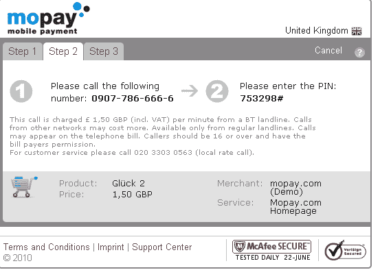

# Mopay 现在允许您将移动支付记入固定电话账户 

> 原文：<https://web.archive.org/web/https://techcrunch.com/2010/07/19/mopay-now-allows-you-to-bill-mobile-payments-to-a-land-line-account/>

# Mopay 现在允许您将移动支付记入固定电话账户

移动支付公司 [mopay](https://web.archive.org/web/20221210070806/http://mopay-inc.com/) 正在推出一项新技术，mopay call，允许在线商家允许消费者将购买的商品记入他们的固定电话账户。与竞争对手[宗](https://web.archive.org/web/20221210070806/http://www.zong.com/)和[博库](https://web.archive.org/web/20221210070806/http://www.boku.com/)一样，mopay 的平台不要求用户拥有信用卡或银行账户才能进行小额支付。用户输入他们的手机号码，回复一条短信，然后所有的虚拟费用都会自动计入用户每月的手机账单。

通过 mopay call，mopay 成为首批允许用户通过座机账单而非手机账单进行支付的移动支付平台之一。它是这样工作的。在在线结账过程中选择 mopay 呼叫后，mopay 的支付屏幕将提示消费者通过一个简短的自动呼叫授权购买。收款人需要通过收费的座机号码拨打给定的号码，并被要求提供一个特殊代码，mopay 会在在线结账过程中提供给收款人。

授权后，mopay 将费用记入座机电话账户，购买完成。这项费用随后会和语音费用一起出现在消费者的电话账单上。mopay call 不需要任何注册，适用于所有拥有座机的用户。

总部位于德国的 Travian Games 正在使用这项新服务，并看到了 mopay 通话服务的吸引力，mopay 首席执行官 Ingo Lippert 说。Lippert 说，虽然通过座机支付在欧洲很流行，但座机收费在美国还是新鲜事物。

但是采用移动支付的一个障碍是移动运营商向支付系统收取的高额费用(这些费用会转嫁给出版商或开发商)。这些费用可能占购买价格的 10%到 50%，这在交易费用中是一笔很大的金额。但 Lippert 说，固定电话运营商通常收取 10%的费用，这对这个领域来说可能是个好消息。现金流为正的 Mopay 已经筹集了 1500 万欧元，目前通过其平台覆盖全球超过 30 亿人。

问题是座机死了吗？随着手机覆盖范围的扩大，许多人和家庭完全依赖手机，不再需要(和额外的费用)固定电话。目前还不清楚这是否真的能在美国实现。