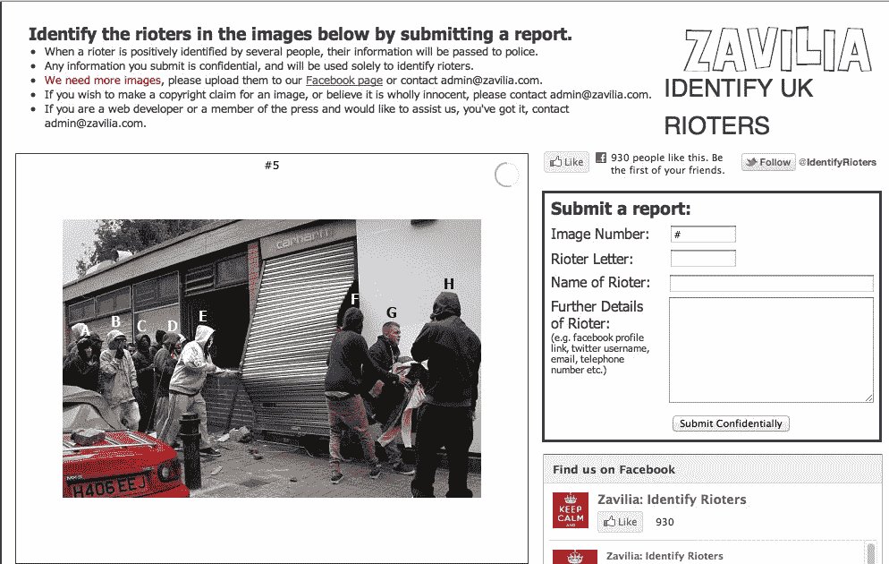
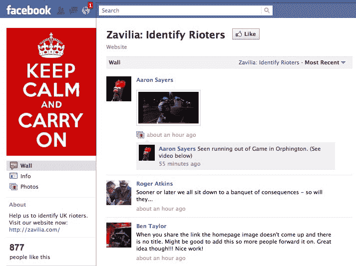

# 新网站贴出暴徒的照片，将身份转发给警方 TechCrunch

> 原文：<https://web.archive.org/web/http://techcrunch.com/2011/08/09/more-crowdsourced-justice-new-website-posts-photos-of-rioters-will-forward-ids-to-police/>

就在今天早上，我们报道了[一个谷歌小组](https://web.archive.org/web/20230216162934/https://techcrunch.com/2011/08/09/google-group-members-to-use-facial-recognition-to-identify-london-rioter/)的成立，该小组的成员正在讨论如何使用面部识别技术在网上照片中识别伦敦骚乱中的抢劫者。现在，第二个网站引起了我们的注意，这使得识别暴徒的过程更加容易，不需要特殊的技术。

这个名为 Zavilia.com[的网站只是简单地发布了它能找到的所有抢劫者的照片，并在每张照片旁边提供了一个简短的表格，你可以在上面输入罪犯的名字。](https://web.archive.org/web/20230216162934/http://zavilia.com/)

据该网站称，提交的所有信息都是保密的，并且只用于识别暴徒。当足够多的人肯定地认出同一个暴徒时，这些信息将被转交给警方。

目前 Zavilia.com[上只有十几张照片，但考虑到该网站推出还不到 24 小时，这是可以理解的。](https://web.archive.org/web/20230216162934/http://zavilia.com/)

**在脸书和推特上也是**

与此同时，该网站的创建者们正在其[脸书页面上积极征集照片提交，一些用户](https://web.archive.org/web/20230216162934/https://www.facebook.com/pages/Zavilia-Identify-Rioters)[也帮忙把照片](https://web.archive.org/web/20230216162934/https://www.facebook.com/pages/Zavilia-Identify-Rioters/228018227243152?sk=wall)贴在墙上。

谁是幕后黑手？未知。

扎维利亚的团队负责人“马修”告诉我，该网站是由“一个试图协助警方调查的英国公民团队”运营的他说有三个人参与其中。

“由于我们参与的事件的敏感性，我们试图隐藏我们的真实身份，”他说。“我相信你也知道，有些人不同意‘点名羞辱’罪犯(通常是罪犯自己)的网站。我们作为一个团队达成一致，我们不想让自己暴露在任何危险中。”

还有一个与这项工作相关的 Twitter 账户。根据半小时前发布的一条推文，用户提交的信息已经确认了一些暴徒。

https://twitter.com/#!/识别暴乱者/状态/100977464238555136

马修证实，该网站已经确定了某些暴徒，但不会说是哪些或有多少。这些身份证还没有交给警方。

他还指出，支持使用视频片段识别暴徒将很快增加。