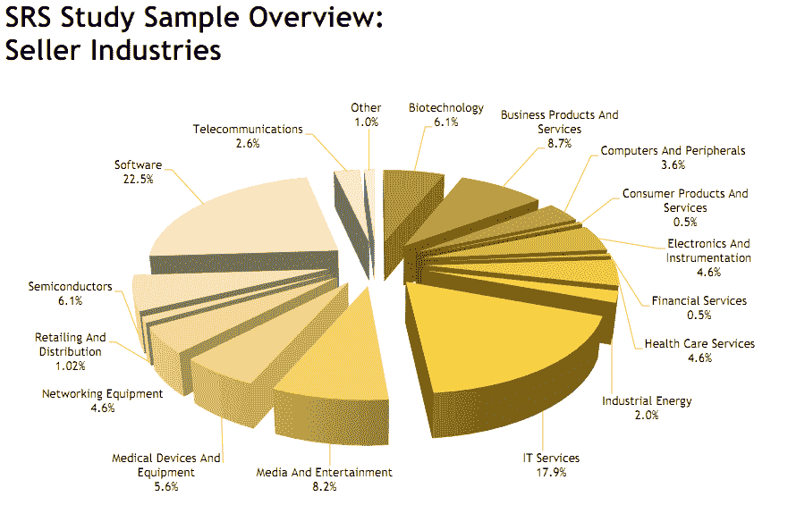

# 更多成长型股票:自 2008 年以来，初创公司的平均融资轮数增长了 27% 

> 原文：<https://web.archive.org/web/https://techcrunch.com/2011/11/02/more-growth-equity-please-average-number-of-rounds-raised-by-startups-up-27-since-2008/>

如今的风投市场，是年龄先于美貌。这是根据[今天](https://web.archive.org/web/20230203150808/http://www.marketwatch.com/story/srs-deal-terms-study-reveals-new-ma-benchmarks-and-trends-2011-11-02)由[股东代表服务](https://web.archive.org/web/20230203150808/http://www.shareholderrep.com/) (SRS)发布的一项新的研究，该公司在并购交易的交割后过程中代表股东利益。换句话说，SRS 是一个独立的股东代言人，为一系列令人印象深刻的[客户](https://web.archive.org/web/20230203150808/http://www.shareholderrep.com/clients/)提供通信、会计和争议解决服务，其中包括 Accel、Benchmark、Kleiner Perkins、Sequoia、Khosla 等。(基本上，这份名单是风险投资公司的名人录。)

这项研究考察了 SRS 在 2010 年 7 月至 2011 年 9 月期间参与的 196 笔交易，发现了这些 M&A 交易条款的趋势:其中之一是，与三年前相比，如今初创企业在退出前筹集的外部融资明显更多。

研究发现，公司平均筹集 3.57 轮优先股融资——这种投资是风险资本和私募股权公司的主要投资。这比 2008 年增长了 27%以上，当时初创企业平均获得 2.8 轮融资。从本质上讲，买家青睐那些筹集了更多资金且盈利的公司。在经济不景气的情况下，企业更不愿意将大量资金投入 M&A，因此买家正在寻找安全的投资。

此外，根据 Dealogic 的数据，由于市场波动和糟糕的金融状况，全球 M&A 活动在第三季度下降了 19%。因此，随着交易的枯竭和很少有公司寻求收购，初创公司反而选择寻求进一步的融资。这可能是我们看到“F 系列”越来越多的原因，也可能是后期融资正在经历变化的另一个结果。

[正如 Business Insider 所言](https://web.archive.org/web/20230203150808/http://www.businessinsider.com/the-way-companies-are-getting-financed-is-completely-changing-2011-11)，公司现在等待 IPO 的时间更长了，二级市场正在兴起，后期私募股权正在兴起，由于互联网和大量融资选择，无论是众筹、加速器等，投资成熟的私营公司变得越来越有效。

SRS 还发现了今年的另一个上升趋势:现金交易。根据这项研究，由于低利率和充足的现金储备，它参与的 86%的交易都是全现金交易。正如 SRS 董事总经理马克·沃格尔[对 peHub](https://web.archive.org/web/20230203150808/http://www.pehub.com/124499/pretty-young-startups-are-nice-but-buyers-go-for-profitable-older-cos-says-study/)所说，如今的买家“拥有大量离岸现金，不想向美国支付遣返税。他们宁愿使用这些现金”。

这些现金似乎正在流入大型交易，因为 25%的交易金额超过 2 亿美元，软件和 IT 服务行业占过去 14 个月出售业务的 40%以上。

因此，随着更多的现金交易成为后续和后期融资率提高的一部分，管理团队变得更加稀释，并要求进一步的激励措施，以符合买家在收购期间设定的里程碑。该研究发现，这导致了管理层例外计划的增加，这在 2010 年占交易的 33%，在 2011 年占交易的 25%。

对于初创公司和中层企业来说，似乎普遍的趋势是筹集更多资金，推迟 IPO，等待合适的买家——用现金。

【T2

[摘自 myLot.com 的图片](https://web.archive.org/web/20230203150808/http://www.mylot.com/w/photokeywords/more+money.aspx)