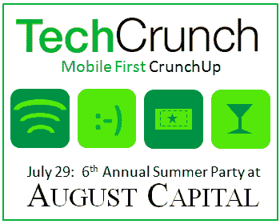
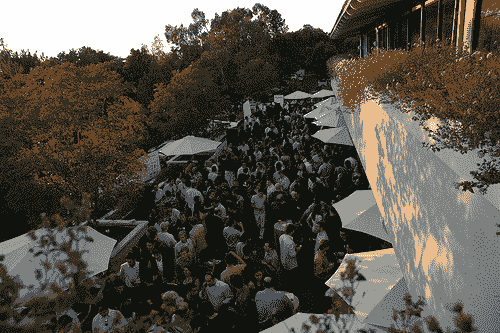

# 八月资本第六届年度夏季派对门票现已发售 

> 原文：<https://web.archive.org/web/http://techcrunch.com/2011/07/07/more-tickets-6th-annual-summer-party-august-capital/>

# 八月之都第六届年度夏季派对门票现已发售

**更新:**门票现已售完。下周请务必回来查看我们的下一组门票。

离我们在八月资本的第六届年度夏季派对只有几个星期了。我们的前两批 100 张门票不到一小时就卖光了。今天我们又释放了 100 只。该派对将于 7 月 29 日跟随我们的[移动第一仰卧起坐](https://web.archive.org/web/20230203040249/https://techcrunch.com/2011/06/24/mobile-crunchup-summer-party/)，并将于下午 5:30-10:00 在门洛帕克举行。在硅谷最漂亮的道路之一，将会有创业演示、饮料、赠品、网络和娱乐的混合。票很快就会卖光，所以如果你想去的话，一定要快点行动。如果你今天买不到票，请继续关注本周末的赠票活动。我们也将在下周发布我们的下一组门票。

门票现在在这里开始出售。

不幸的是，我们的手机第一次仰卧起坐的门票已经售罄。尽管如此，我们仍然有数量有限的记者证。联系 [me](https://web.archive.org/web/20230203040249/mailto:elin@beta.techcrunch.com) 请求新闻通行证考虑。

这是我们夏季派对的后勤物资。

**八月之都第六届年度夏季派对**
7 月 29 日，下午 5:30–10:00
加利福尼亚州门洛帕克市沙山路 2480 号，[地图](https://web.archive.org/web/20230203040249/http://www.mapquest.com/maps?address=395%20Page%20Mill%20Rd&city=Palo%20Alto&state=CA&zipcode=94306-2024#f21e7daab34eb1e1ea6e6b75)
[获取门票](https://web.archive.org/web/20230203040249/http://mobilefirstcrunchupandaugustcapitalparty2011.eventbrite.com/) @ Eventbrite: $40 视情况而定。门票每周分批发售。请继续关注 TechCrunch，因为它们很快就会售罄。#tcaugustcapital

**赞助**
联合举办的 CrunchUp-Summer Party 也为初创公司和品牌提供了一个很好的赞助平台，可以接触到会议和网络参与者。请联系 [Jeanne Logozzo](https://web.archive.org/web/20230203040249/mailto:jeanne@beta.techcrunch.com) 或 [Heather Harde](https://web.archive.org/web/20230203040249/mailto:heather@beta.techcrunch.com) 了解更多关于赞助套餐和定制机会的信息。

