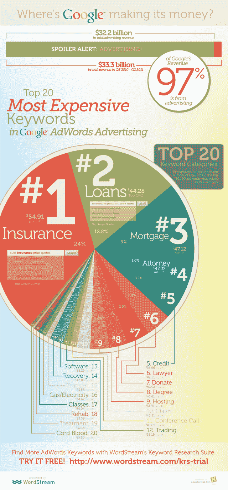

# Google AdWords 中最贵的 20 个关键词类别是什么？

> 原文：<https://web.archive.org/web/http://techcrunch.com/2011/07/18/most-expensive-google-adwords-keywords/>

# Google AdWords 中最贵的 20 个关键词类别是什么？

谷歌从在线广告中为 T2 赚了一大笔钱。事实上，谷歌收入的 97%来自广告，在过去的 12 个月里，谷歌的总收入为 333 亿美元。

[WordStream](https://web.archive.org/web/20230203034715/http://www.crunchbase.com/company/wordstream) ，一家由[风险投资支持的](https://web.archive.org/web/20230203034715/https://techcrunch.com/2010/05/07/wordstream-funding/)托管软件提供商，它自动化了大部分涉及创建和优化付费和自然搜索引擎营销活动的手工工作，已经做了一些研究来发现在谷歌的 [AdWords 解决方案](https://web.archive.org/web/20230203034715/http://www.crunchbase.com/product/google-adwords-2)中，哪些关键词类别获得了[最高的每次点击成本](https://web.archive.org/web/20230203034715/http://www.marketwire.com/press-release/where-does-google-make-its-money-new-research-from-wordstream-reveals-most-expensive-1539227.htm) (CPC)。

当然，他们根据他们的研究结果制作了一个信息图表。

WordStream 从其庞大的关键词数据库和谷歌关键词工具中收集数据，在 90 天内确定了 10，000 个最昂贵的英语关键词。

随后，该清单按主题进行了分类。然后，通过加权每个类别中的关键词数量，以及每个关键词的估计每月搜索量和平均每次点击成本，确定最大的关键词类别。

需要说明的是，Google AdWords 是一个基于拍卖的市场，广告商通过对关键词竞价来争夺顶级广告位置，每个关键词的最低竞价为 5 美分。

要求最高每次点击成本的前二十个关键词类别是:

1.保险(示例关键词:“车险价格行情”)
2。贷款(示例关键词:“巩固研究生贷款”)
3。抵押贷款(例子关键字:“转按揭第二”)
4。代理律师(示例关键词:“人身伤害代理律师”)
5。信用(示例关键字:“房屋净值信用额度”)
6。律师
7。捐
8。度
9。主持
10。权利要求
11。12 电话会议。交易
13。软件
14。恢复
15。转移
16。煤气/电力
17。类别
18。戒毒
19。待遇
20。脐带血

不出所料，最昂贵的关键词类别列表显然是人们集体转向网络寻求帮助的结果，无论是金融、教育、专业服务还是医疗援助。WordStream 的结论是，数量和成本最高的关键词类别代表着终身客户价值非常高的行业:换句话说，由于其业务性质，公司可以支付大量费用来获得新客户。

但我个人从未想过,“保险”会让谷歌每次点击净赚近 55 美元。想一想。

