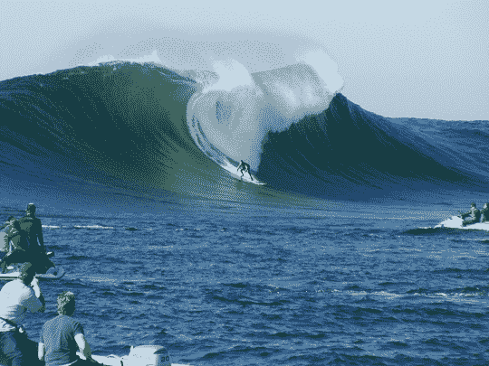
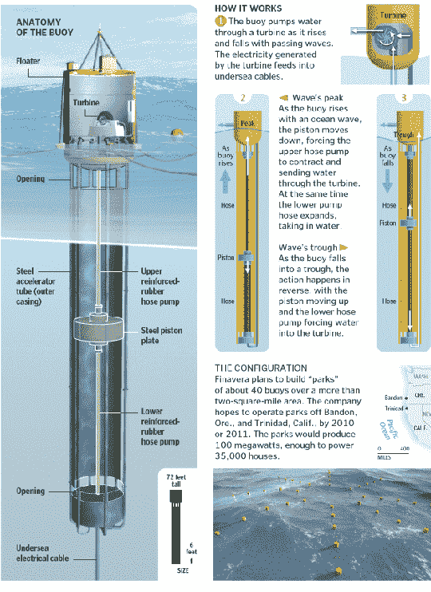

# 海洋母亲为我们的游戏机、电视等提供能量。

> 原文：<https://web.archive.org/web/http://techcrunch.com/2007/12/19/mother-ocean-to-juice-our-xboxes-tvs-etc/>

# 海洋母亲为我们的游戏机、电视等提供能量。

那是小牛队，半月湾的世界级大浪淘沙点。

油价正在失控。风能和太阳能有些不可预测，显然它们“成本太高”。几周前，我看了《T4》《南国故事》,这部电影是关于世界末日和所有这些疯狂的事情。除了莎拉·米歇尔·盖勒是色情明星之外，这部电影有趣的地方在于替代能源是从海洋中抽取的。这不是火箭科学(或者与之相近的东西)，但是我可以想象建造某种巨大的涡轮机会产生大量的自由能量，对吗？

Finavera 可再生能源公司有一个叫 Aquabuoy 的东西，它是一个连接到水下活塞的浮标。你能弄清楚它是如何工作的吗？没有吗？好吧，好吧。当涌浪翻滚时，浮标随着水流上下起伏。这反过来使活塞运行，从而给海水占据的舱室加压。所述压力使涡轮机运转，如果你现在还不明白的话，涡轮机产生电力。这很酷，但那又怎样？

嗯，Finavera 刚刚在 Nor*Cal 和 PG&E 达成了一项协议。购买的电力用于一个将生产 2 兆瓦果汁的海浪农场，该海浪农场将建在离洪堡县海岸 2.5 英里的地方。它实际上要到 2012 年才能建成并运行，但它每年将抵消 245 吨二氧化碳，如果一切顺利，Finavera 希望将波浪农场建成一个 100 兆瓦的生产钻井平台。

但是，这个光荣的想法并不总是好的。运行起来比煤和天然气更贵，但比海上风力涡轮机和太阳能便宜。最近在俄勒冈海岸进行的一次测试失败了，因为浮标在水中下沉了。我的母校已经在这方面研究了很长一段时间，而 O.H. Hinsdale 波浪研究实验室是一个世界级的设施，他们在那里研究海啸和海洋中发生的任何事情。有人告诉我中心的头几个小时后在波浪池里冲浪，这很棒。无论如何，可再生能源的前景看好，但我们离看到这方面的任何实际进展还有很长的路要走。

[波浪能将在加州商业化](https://web.archive.org/web/20230327212041/http://www.news.com/Wave-power-to-go-commercial-in-California/2100-13840_3-6223220.html?part=rss&tag=2547-1_3-0-5&subj=news)【news.com】