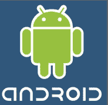

# 摩托罗拉组建 350 人的安卓团队。诺基亚也四处嗅着。

> 原文：<https://web.archive.org/web/https://techcrunch.com/2008/09/28/motorola-building-up-350-person-android-team-nokia-also-sniffing-around/>

# 摩托罗拉组建 350 人的安卓团队。诺基亚也四处嗅着。

对于严肃的移动网络开发者来说，iPhone 可能是目前在 T2 唯一的游戏，但这不会持续太久。明年，iPhone 将面临来自谷歌 Android 平台的激烈竞争。当然，T-Mobile 将于 10 月 22 日开始销售第一款安卓手机，由 HTC 制造的 G1。但是其他手机制造商正准备大力推广安卓系统。

其中最重要的可能来自摩托罗拉。据一位被猎头接洽加入团队的安卓开发者称，作为开源移动操作系统背后的[开放手机联盟](https://web.archive.org/web/20230213055441/https://techcrunch.com/2007/11/05/breaking-google-announces-android-and-open-handset-alliance/)的原始合作伙伴之一，摩托罗拉的安卓团队已经有 50 人，并将增加到 350 人。这是一个巨大的承诺，表明摩托罗拉在 Android 上下了多大的赌注。

同一消息来源也在最近的 Android 开发者大会上看到了来自诺基亚和威瑞森的人。上周，谷歌为尚未见过 G1 的开发者举办了这次会议，以帮助他们为其发布做准备。一般来说，要成为一名与会者，你必须有一个 Android 应用程序。诺基亚和威瑞森都不是开放手机联盟的正式成员。

诺基亚最近收购了它尚未拥有的 Symbian 的剩余部分，并决心尽可能长久地保留该操作系统，因为它为其所有的 S60 手机提供支持。但诺基亚可能有一个 Android 团队在四处打探，这是明智的，即使这只是为了获取竞争情报。如果安卓起飞，诺基亚可能会决定对冲赌注，推出自己的安卓手机。

对 Android 的所有兴趣背后都有某种必然的逻辑。

1.它是一台比 iPhone 更强大的移动网络电脑。
2。对于应用开发者来说，这是一个非常有吸引力的开发环境——就像在 PC 上一样，应用将推动应用的采用。
3。最重要的是，作为一个开源的 OS，制造商不必向控制 OS 的人支付许可费。考虑到手机业务利润微薄，仅此一点就足以让制造商们接受 Android(拥有 Symbian 的诺基亚除外)。但是你可以理解为什么摩托罗拉会把 Android 视为其复苏的关键。