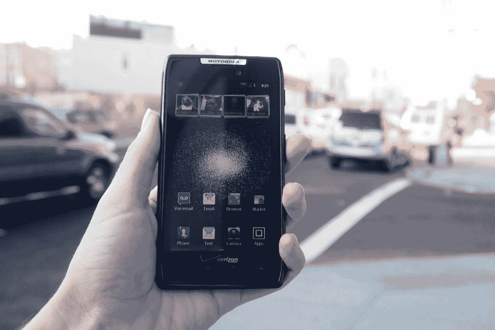
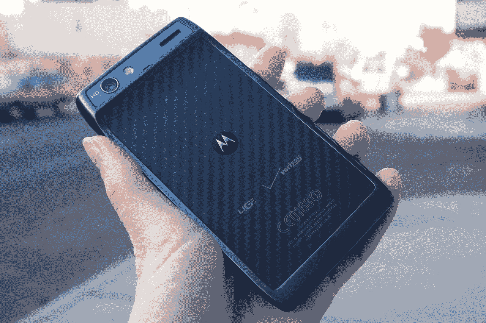
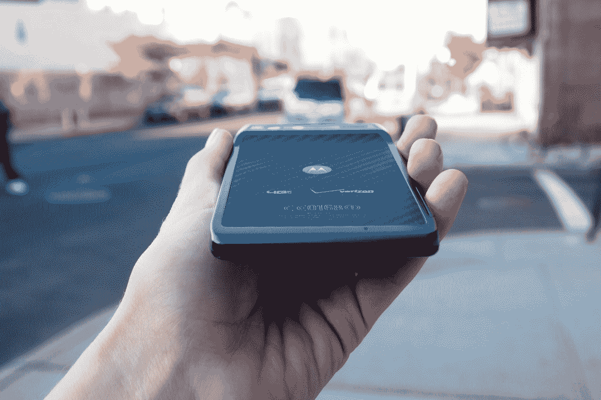
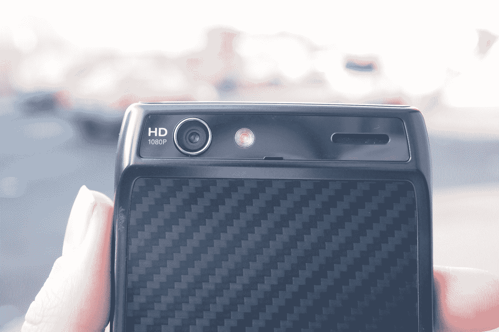

# 摩托罗拉 Droid RAZR 评论:如此接近，却又如此遥远

> 原文：<https://web.archive.org/web/http://techcrunch.com/2011/11/07/motorola-droid-razr-review-so-close-yet-so-far/>

## 简短版本

Droid RAZR 是一款备受期待的手机，但它的性能能跟上宣传的步伐吗？是不是太大了不舒服？7.1 毫米的腰围有什么特别之处吗？4G LTE 搭配双核处理器真的有作用吗？好吧，这基本上是我存在的全部意义来为你回答这些问题。所以我们走吧。

## 特点:

*   4.3 英寸 540×960 qHD Super AMOLED 显示屏
*   双核 1.2GHz 处理器
*   800 万像素后置摄像头，带 LED 闪光灯、自动对焦和 1080p 视频拍摄功能
*   130 万像素前置摄像头
*   安卓 2.3.5 姜饼
*   4G LTE
*   建议零售价:299 美元，合同价，11 月 11 日上市

## 优点:

*   7.1 毫米的腰线使 Droid RAZR 成为世界上最薄的智能手机
*   真正美丽独特的设计搭配同样华丽的显示屏
*   MOTOCast 支持—在 PC 和手机之间无缝传输任何媒体

## 缺点:

*   倾向于过热一点，因此慢下来
*   非常轻，感觉很便宜，对于一部 299 美元的手机来说，这不是你想要的
*   这应该是意料之中的，但电池寿命是一个半身像

【T2

## 长版本:

毫无疑问，威瑞森的 Droid RAZR 是一款非常小的手机。4G LTE 支持和双核处理芯片的结合带来了非常爽快的体验，设计本身就说明了问题。虽然我不确定我能告诉你它 299 美元的价格是否物有所值，但我可以说它肯定值得成为这个假期的顶级竞争者之一。

## 硬件:

对于 Droid RAZR 的设计，首先要说的一点是:它非常薄。事实上，它太薄了，以至于我不确定照片或视频是否能把它拍好。如果你持观望态度，请去商店里拿起一台设备，用手好好感受一下，因为我有一种感觉，RAZR 适合某种类型的品味。

首先，它对我来说有点大。我一直认为我的手对于一个女孩来说相当大，但我仍然觉得拿着 RAZR 到处跑很笨拙，把它从口袋里拿出来，或者只是从肖像切换到风景。也许随着时间的推移，这种安慰会发生，但这是值得考虑的。然后是重量的问题。我以前说过，我还会再说一遍，但仅仅因为这个或那个小工具是“最轻的”，并不意味着这是一件好事。最轻的小玩意通常是更便宜的，由塑料制成，因此容易损坏。机器人 RAZR 在那条线上摇摇晃晃，非常漂亮，但我必须承认，有时它感觉比我想要的轻一点。特别是对于一部如此薄的手机来说，握在手中的一点重量将大大有助于确保坚固性。

就设计而言，我非常迷恋 RAZR。安卓设备往往都融合在一起，当你冒险深入摩托罗拉品牌的安卓设备类别时，情况只会变得更糟。RAZR 的风格与其他 Moto 兄弟不同，虽然它保留了一些设计语言，如背部的经典 Moto hump，尖锐和方形的边角以及 Kevlar 纤维外壳，使它具有独特的外观。更不用说，背板手感非常好，就像是柔软触感橡胶的昂贵替代品。

如果说 Droid RAZR 第一眼有什么闪光点的话，那就是屏幕。4.3 英寸的显示屏本身就是一种美丽，如果你喜欢游戏或移动视频，你肯定需要对这款设备三思而行。此外，显示器涂有大猩猩玻璃，以防止小水滴和著名的“后袋测试”

## 软件:

你应该已经知道，摩托罗拉 Droid RAZR 运行 Android 2.3.5 姜饼和(感谢上帝！)没有 MotoBLUR 挡路。仍然有某种形式的制造商皮肤运行在 Android 上，但无论如何想象，它都不像 Blur 那样沉重和令人讨厌。

出乎意料的是，Droid RAZR 的大多数预装应用程序实际上都很有用，甚至可能在你的购买决策中发挥作用。首先，NFL Mobile 在 2011 赛季免费向 4G LTE 用户开放。然后，我们有网飞高清，只是必须把这样一个惊人的大规模显示使用。

我认为 MotoCast 集成对许多消费者来说也是一个很大的吸引力，在我使用它的时候，它被证明是一个漂亮的小服务。这与苹果的 iCloud 想法类似，尽管没有那么全面。但总的来说，这项服务快速、简单、可靠，这是你能从设备间的流媒体中得到的一切。它让过去单调乏味的任务变得天衣无缝，让你想知道为什么我们一直没有这样做。

威瑞森以 V CAST Tones、威瑞森视频和 VZW 导航应用的形式在 RAZR 上留下了印记。与此同时，Moto 还包括 MOTOPRINT 和 MotoACTV 应用程序，可以让你在你的 [MotoACTV 智能手表](https://web.archive.org/web/20230203072313/https://techcrunch.com/2011/10/18/motorola-announces-the-motoactv-smart-watch/)和 RAZR 之间同步信息。Quickoffice 和 GoToMeeting 也进入了 RAZR，goto meeting 肯定会让任何套装满意并微笑。

威瑞森也包括了重磅炸弹应用程序，以及 Madden NFL 12 的试用版。

## 性能:

说到马登，它杀了 RAZR。摩托罗拉在纽约的发布会上对 RAZR 的电池寿命做出了各种不切实际的承诺，没有人比我更怀疑了。4G 无线电消耗了大量的能量——他们不是故意的，只是控制不住。也就是说，4G LTE 设备总是被定位为更快死亡，RAZR 也不例外。Droid RAZR 待机大约 6 个小时，密集使用大约 3 个小时，包括游戏、视频和浏览，今天早上它死了之后让我睡了个懒觉。摩托罗拉提供了一些节省电池的工具，我强烈推荐给 RAZR 的潜在用户。

就基本性能而言，我对 RAZR 没有太多抱怨。在主屏幕之间切换，在浏览器中滚动，以及在图像库中缩放命令都像我希望的那样流畅和快捷。浏览器加载页面没有任何问题，但我惊讶地发现，Android 浏览器被我的 iPhone 4S 的 Safari 浏览器和 Focus Flash 的 IE9 Windows Phone 浏览器打败了。我通过 WiFi 和手机各自的网络进行了测试，在这两种情况下，Droid RAZR 都名列第三。然而，没有理由抱怨。IE9 是我在手机上见过的最快的浏览器之一，还有 iPhone 4S……嗯，那才是真正需要做出决策的地方。如果你是 Android 的忠实用户，尽量不要让这个特殊的速度因素太重要。否则，考虑一下 iPhone 4S。尤其是如果你总是在网上冲浪的话。

我很快注意到的一件事是，机器人 RAZR 很热。是的，至少可以说这是一款性感的手机，但它也很容易过热。在启动手机并开始使用的瞬间，它就燃烧起来，每次我使用它时都是这样。当然，性能的下降很小，但是如果你注意的话，你会注意到的。手机温度越高，加载应用程序或在多任务处理过程中恢复应用程序的时间就越长。

这个坏小子身上的摄像头简直不能忽视。至少可以说，用 800 万像素的相机拍摄的静态图像质量很高，但真正让我印象深刻的是 RAZR 的视频捕捉能力。拍摄静态照片时，相机会调整一段时间来对焦，然后再花一两秒钟来抓拍照片。手机摄影显然不擅长任何形式的滞后，所以看到这一点有点难过。但是，另一方面，视频捕捉速度快，响应快。

即使你有点发抖，照相机似乎也能很好地聚焦。此外，我注意到在拍摄视频时，相机在明暗设置之间调整得非常快。在许多手机上，从黑暗的房间走到阳光下的时间可能会过长，但我发现 RAZR 可以很快消除这些担忧。很自然，Droid RAZR 配备了一个 HDMI-out 端口，因此您也不必对 1080p 视频感到害羞。

## 结论:

摩托罗拉在发布前的大肆宣传让我的期望很高，但 Droid RAZR 能赢得我的心吗？差不多了。我仍然不认为轻量级的感觉很适合摩托罗拉追求的高级体验，RAZR 的电池也有很多不足之处。即便如此，摩托罗拉还是设法用 Droid RAZR 组装了一个非常令人印象深刻(更不用说华丽了)的软件包，如果你能忍受一些缺点，也有很多值得喜欢的地方。