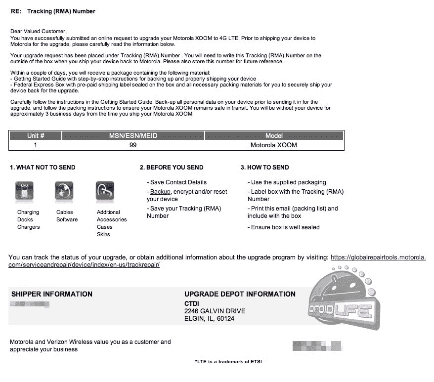

# 摩托罗拉 Xoom LTE“试点”计划正在进行 

> 原文：<https://web.archive.org/web/http://techcrunch.com/2011/08/25/motorola-xoom-lte-pilot-program-underway/>

# 摩托罗拉 Xoom LTE“试点”计划正在进行中

不久前，威瑞森承诺其摩托罗拉 Xoom 平板电脑将在春季前获得更新，允许平板电脑在运营商的 4G LTE 网络[上运行。如果你不知何故在岩石下幸存，却不知道那意味着什么，这是一件大事。速度的提高给平板电脑增加了不可估量的价值，因为，你知道，时间就是金钱。唯一不同的是，春天来了又去，夏天也是如此。还是没有更新。](https://web.archive.org/web/20230203200052/https://techcrunch.com/2011/04/28/xoom-gets-security-bluetooth-update-but-no-lte/)

但是，唉，一封信已经发送给…企业和政府 Xoom 所有者？嗯。好的。因此，根据 [Droid-Life](https://web.archive.org/web/20230203200052/http://www.droid-life.com/2011/08/24/xoom-4g-lte-upgrades-set-to-begin-business-and-government-users-up-first-in-pilot-group/) 的说法，显然政府和其他商业类型的雇员将先于所有人“试点”LTE Xoom。很奇怪，但是我们真的不在乎，只要这次更新是真的。我们的试点测试人员将在下周获得更新，所以我们普通人将有一段时间去。

当你收到摩托罗拉发来的电子邮件，告诉你如何开始行动时，你就知道是时候了。摩托罗拉建议在开始之前快速备份，因为这是一个相当大的更新，可能会擦除设备。摩托罗拉还说，在你把 Xoom 送去升级后，至少要做好三天不用 Xoom 的准备。

下面是摩托罗拉来信的复印件:
