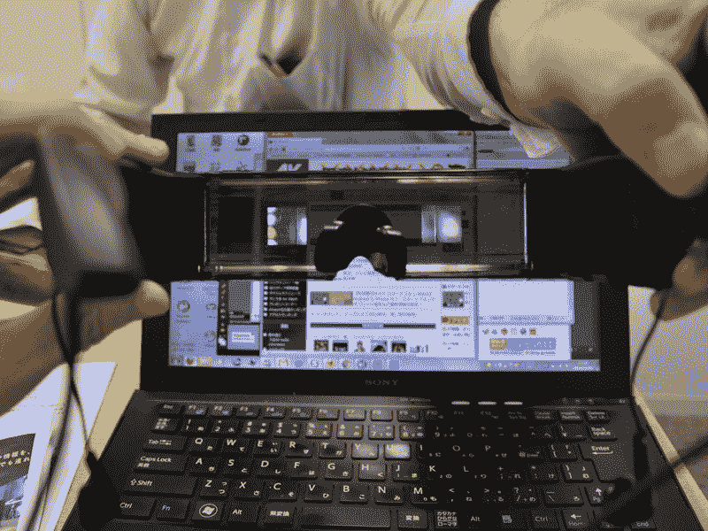
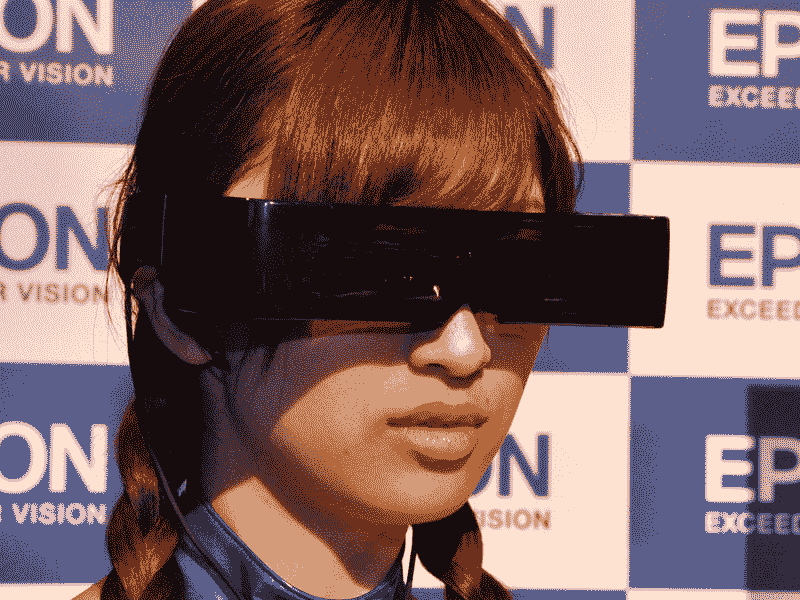
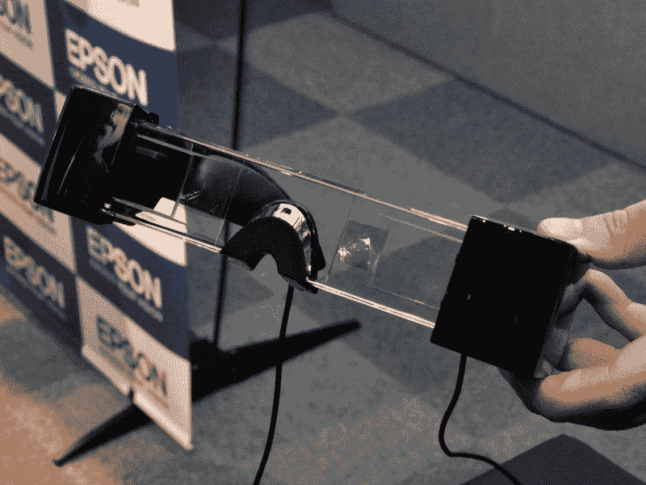
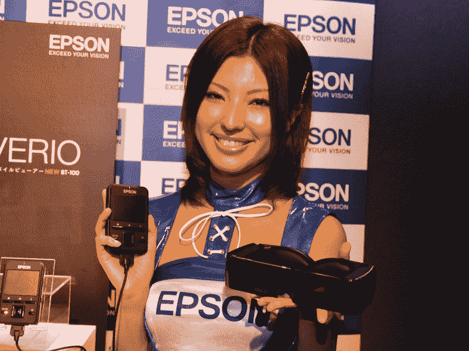

# Moverio:爱普生宣布推出全球首款透明 3D 头戴显示器 TechCrunch

> 原文：<https://web.archive.org/web/http://techcrunch.com/2011/11/09/moverio-epson-announces-worlds-first-see-through-3d-head-mounted-display/>

# Moverio:爱普生宣布推出全球首款透明 3D 头戴显示器

爱普生日本公司[宣布了](https://web.archive.org/web/20230203070638/http://www.epson.jp/osirase/2011/111109.htm) [JP】所谓的 Moverio today，一款透视 3D 头戴显示器(HMD)，据该公司称，这是同类产品中的第一款。你可以把它想象成 T2 NEC 的透明 HMD 远程侦察器 T3 和 T4 索尼的 3D 有机发光二极管头盔显示器 HMZ-T1 T5 的混合体，由 Android 操作系统驱动。

Moverio 创造了在 5 米外的 80 英寸虚拟显示器上观看 3D(或 2D)图片的体验，同时仍然能够看到现实世界中发生的事情。除了显示器本身，用户还可以获得一个小型控制器，提供 1GB 的内部存储器和一个 microSD 卡插槽。

Moverio 支持 MPEG-4/MPEG-4 AVC/H.264 视频文件，包括在其分辨率为 960×540 的 0.52 英寸显示屏上显示的–[并排 3D](https://web.archive.org/web/20230203070638/http://www.best-3dtvs.com/what-is-side-by-side-3d/) 图像(它还可以处理 AAC 和 MP3 音频文件)。

 

爱普生还将 Android 2.2、Wi-Fi IEEE 802.11b/g/n(直接访问 YouTube 和一个网络浏览器)和一个 microUSB 挤到了设备中。

Moverio 的耳机尺寸为 205×178×47mm，重量为 240g，而控制器的尺寸为 67×107×19mm，重量为 160g。

 

爱普生预计该设备将于 11 月 25 日在日本商店上市，最初销量为 1 万台(价格:770 美元)。

Via [AV 手表](https://web.archive.org/web/20230203070638/http://av.watch.impress.co.jp/docs/news/20111109_489443.html) [JP]