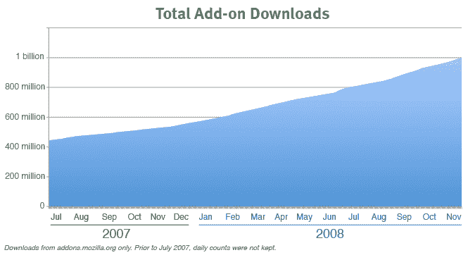

# Mozilla 插件下载量达到 10 亿次 

> 原文：<https://web.archive.org/web/https://techcrunch.com/2008/11/19/mozilla-add-ons-hit-one-billion-downloads/>

# Mozilla 插件下载量达到 10 亿次

在其他 Mozilla 新闻中，Firefox 和其他 Mozilla 产品今天达到了一个重要的里程碑，浏览器附加软件的第[十亿次下载](https://web.archive.org/web/20230202233048/http://blog.mozilla.com/addons/2008/11/19/1-billion-add-on-downloads/)。这一壮举耗时三年半。

当然，这些下载中有许多从未被使用超过一次或两次。但毫无疑问，火狐是主要的软件平台。看看 StumbleUpon 就知道了，它是建立在 Firefox 之上的。

目前[最受欢迎的](https://web.archive.org/web/20230202233048/https://addons.mozilla.org/en-US/firefox/browse/type:1/cat:all?sort=popular)附加产品列表的榜首是什么？ [Adblock Plus，](https://web.archive.org/web/20230202233048/https://addons.mozilla.org/en-US/firefox/addon/1865)后面跟着一堆下载工具。让我们不要忘记排在第九位的 [Greasemonkey](https://web.archive.org/web/20230202233048/https://addons.mozilla.org/en-US/firefox/addon/748) ，这是它自己的网络开发平台。