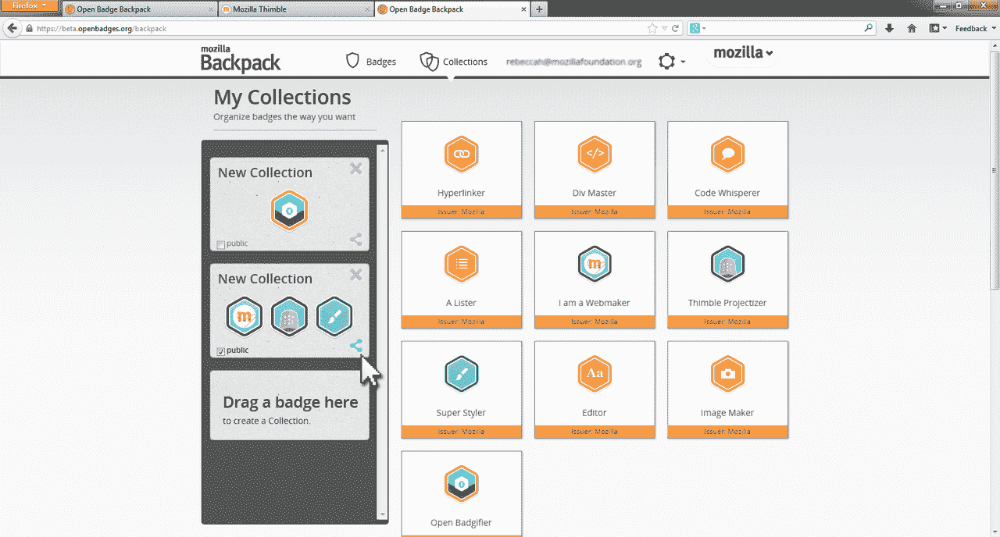
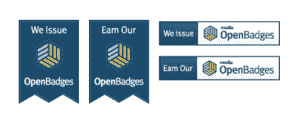

# Mozilla 推出 Open Badges 1.0，这是一种识别和验证在线学习和教育的新标准 

> 原文：<https://web.archive.org/web/https://techcrunch.com/2013/03/14/mozilla-launches-open-badges-1-0-a-new-standard-to-recognize-and-verify-online-learning-and-education/>

随着基于网络的学习平台激增，教育越来越多地发生在正式和非正式的环境中，以及真实和虚拟的教室中，越来越需要一种新形式的证书来反映这些变化。传统的纸质文凭和证书已经不够了，但是设计一个有意义的，通用的旧标准的替代品不是一朝一夕的事情。幸运的是，Mozilla 正在调查这个案子。

[早在 2011 年 9 月](https://web.archive.org/web/20221202105608/https://blog.mozilla.org/blog/2011/09/15/openbadges/)，Mozilla 宣布它正在着手一项任务，为在网上发布和分享数字学习徽章创造一个简单的方法。当时被称为“[开放徽章基础设施项目](https://web.archive.org/web/20221202105608/http://openbadges.org/)”的项目源于 Mozilla 自己为其 Webcraft 学校开发的徽章，但它很快意识到，在设计和实现数字徽章的计划中，它并不是唯一的一家。

因此，Mozilla 决定将网络(和在线教育)做得更扎实，其长期目标是允许任何人和每个人“从互联网上的任何网站收集徽章，将它们组合成一个关于你所知道的和你所取得的成就的故事……这是一个真正的机会来创造更像网络一样的学习，”Mozilla [在](https://web.archive.org/web/20221202105608/https://blog.mozilla.org/blog/2011/09/15/openbadges/)公告中说。特别是 Pathbrite 和[degree](https://web.archive.org/web/20221202105608/https://beta.techcrunch.com/2012/11/18/degreed-wants-to-jailbreak-the-college-degree/)一直在点头表示同意。

开放徽章从那时起就处于测试阶段，但是今天 Mozilla 正式宣布了 1.0 版的开源自由软件，任何组织现在都可以使用它来创建、发布和验证数字徽章。该平台本质上旨在创造一种开放徽章的教育货币，允许学生(实际上是任何学习者)展示这些徽章，总之，旨在讲述“你的技能和成就的全部故事”。

反过来，开放徽章使任何人都可以从各种来源(离线或虚拟)收集这些徽章到其数字背包中，然后您可以使用它在社交网络、工作网站、个人网站等上展示您的技能。

作为其新版本的一部分，Mozilla 现在还提供“发行者徽章”，允许组织展示他们提供的开放徽章(Mozilla 表示，它将在不久的将来使这些成为可嵌入的)。

 至于是谁提供了赚取徽章的机会？嗯，一旦你登录了这个平台，你可以选择从 Mozilla 获得一个 Webmaker 徽章(并设置你的背包)，然后仔细阅读[开放徽章社区](https://web.archive.org/web/20221202105608/http://www.openbadges.org/community/)。有超过 600 家组织已经实施或正在实施该标准，其中包括史密森尼美国艺术博物馆、纽约市教育局、伊利诺伊大学、EDUCAUSE、Gogo Lab 等将在发布时提供徽章的组织，而 NASA、微软、皮克斯和许多其他组织正在开发徽章。

对于那些希望提供开放徽章的人，比如上面的公司，你必须浏览 Mozilla 的文档，但是参数非常广泛。正如 Mozilla 在其中所说，发行者决定他们自己的 bade 系统背后的“内容和标准”，他们不需要“向 OBI 注册，他们只需将徽章发送到收入者的背包中。”除此之外，这只是安排与 Open Badges 的 API、服务器等的兼容性的问题。

自然，Mozilla 希望尽可能地保持这种广泛性和开放性。虽然不围绕用例及最佳实践放置更多的结构或需求看起来有点目光短浅，但这被设计成尽可能通用和无摩擦的。由你的学校或组织来决定客户/用户必须做什么才能获得徽章，你可以根据自己的需要进行严格控制或灵活调整。

对于那些获得徽章的人来说，Mozilla 允许用户在他们的背包中展示(和管理)它们，或者通过插件在 WordPress 博客和网站[上展示它们，通过 Twitter](https://web.archive.org/web/20221202105608/http://wordpress.org/extend/plugins/wpbadger/) 在[上展示它们——更多还在路上。](https://web.archive.org/web/20221202105608/https://twitter.com/sr71/status/304710805901963264)

 还在迷茫吗？问你自己，“但是等等，Mozilla 正在构建的这个东西是什么——为什么它是开放的？”它的文档提供了一个极好的答案:

> 开放徽章框架旨在允许任何学习者从多个网站收集徽章，绑定到一个身份，然后在各个网站上分享它们，包括个人博客和社交网络渠道。这种基础设施必须开放，让学习者能够控制自己的学习和证书，允许任何人发放徽章，并让每个学习者在网络和其他环境中随身携带徽章。

它的目标进一步阐明了 Mozilla 的使命，即简单地提供一个“替代认证、证书和认可”的系统，并帮助这些替代证书“扩展到孤立的环境之外，以广泛共享”，并“真正支持学习者在任何地方学习。”

冒着打破第四堵墙，失去客观性等等的风险。等等。我要说的是，一般来说，我尽可能避免徽章，并且不止一次地诅咒 Foursquare 推广徽章。然而，这仅仅是我所能想象的“徽章”模式的最佳用途，不可否认，汗学院(已经发行徽章)正在铺平道路。

一个“无关联的”(这个术语用得不太严谨)第三方为凭证共享或数据共享创建 web 标准的事件越多(就像 inBloom 试图为性能数据所做的那样，[更不用说那些胆小的反对者](https://web.archive.org/web/20221202105608/https://www.edsurge.com/n/2013-03-09-opinion-people-who-don-t-want-to-collect-education-data-should-explain-why-it-s-a-bad-idea))，或者无论是什么情况，教育都会变得更好。这是毫无疑问的。

在 [Mozilla 的博客上找到更多信息。](https://web.archive.org/web/20221202105608/http://openbadges.tumblr.com/)