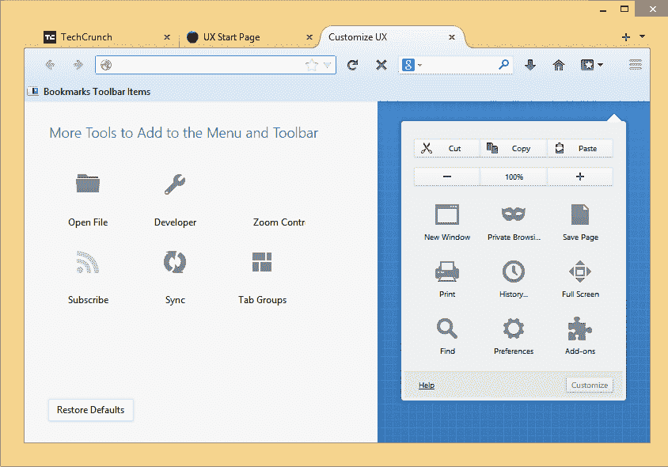

# Mozilla 准备对 Firefox 进行重大重新设计，思考未来的浏览器应该是什么样子 

> 原文：<https://web.archive.org/web/https://techcrunch.com/2013/06/01/mozilla-readies-major-firefox-redesign-as-it-ponders-what-the-browser-of-the-future-should-look-like/>

几天前，Mozilla 的火狐工程副总裁乔纳森·南丁格尔告诉我，“也许我们甚至不应该再把它叫做浏览器了。”。“‘浏览器’真是一个老掉牙的词。人们不再经常浏览网页了。”相反，他认为，我们现在大多使用浏览器来访问复杂的网络应用、基于网络的生产力工具和社交网络。

对于浏览器开发者来说，这意味着他们必须开始重新思考他们的浏览器应该是什么样子，因为使用模式已经改变，大多数用户已经成为非常有经验的互联网(和浏览器)用户。

## 澳大利亚:通过弯曲的标签实现简单

指导 Mozilla 探索现代浏览器应该是什么样子的项目是 [Australis](https://web.archive.org/web/20221209193240/https://wiki.mozilla.org/Firefox/Features/Theme_Refinement_and_Evolution_(Australis)) (因为 Mozilla 显然喜欢以 star systems 命名项目)，这个项目的成果将很快进入 Firefox 的发布渠道，一旦它很快发布第 25 版，就从 Nightly 开始。在那之后，它将通过通常的发布渠道，尽管 Nightingale 告诉我，团队可能会从稳定渠道推迟一段时间，以确保一切顺利进行。

如果你真的喜欢冒险，你可以从 Mozilla 相对不知名的 [UX 分公司](https://web.archive.org/web/20221209193240/http://ftp.mozilla.org/pub/mozilla.org/firefox/nightly/latest-ux/)安装一个版本的 Firefox，并在当前状态下测试它(但如果它经常崩溃或撕碎你的硬盘，不要责怪我们)。

那么澳大利亚是怎么回事呢？乍一看，它比我们今天知道的 Firefox 更像 Chrome。在目前的版本中，Australis 主题的特点是标签的圆角，以及 URL 和搜索框右侧的相同的三栏图标，以弹出下拉自定义和设置菜单。

正如南丁格尔告诉我的那样，Australis 背后的想法是设计一个和今天一样功能强大，但使用更简单的浏览器。该团队还负责密切关注人们实际上是如何使用浏览器的，然后围绕这一点设计用户体验。他认为，新设计更简洁、更直观。他举的一个例子是，在当前的设计迭代中，未选择的标签基本上融入了背景，甚至没有常见的标签边框。当你打开更多的标签时，即使你再也看不到单个标签的图标(像 Chrome 一样)，火狐团队也决定为标签设置一个最小宽度，然后在达到最大标签数量时移动到滚动标签栏。

虽然澳大利亚主题不会在 10 月前登陆稳定频道，但南丁格尔强调，即使是今天的火狐版本也已经受到了该项目的影响。例如，Firefox 中的 stop/load/reload 组合按钮就出自这个组。新的下载管理器也是如此，事实上，当没有页面前进时，Firefox 不再显示前进按钮。定制和工具菜单现在也使用三乘三排列的图标和专用按钮进行复制、选择和粘贴，以及增加字体大小，而不只是使用常规的下拉文本菜单。

当然，这一点在 Firefox for Android 应用程序中已经很明显了，用南丁格尔的话说，这有点像“去年的重生”。然而，现在它的下载量接近 4000 万次，这一成功意味着更大的用户群，以及放缓可能让 Android 用户感到困惑的激进变化的必要性。(如果你想知道，Mozilla 仍然定期关注 iOS 及其在那里的机会，但苹果目前的规则仍然不适用于 Mozilla。然而，该团队正在研究 Mozilla 可以在 iOS 上做的“其他事情”。)

## 用户化

然而，澳大利亚不仅仅是设计。Australis 的一个变化领域是如何定制浏览器的外观和感觉。Mozilla 目前为此提供了相当多的工具，但该团队认为这些工具很难找到，使用起来也不够“有趣”。正如 Mozilla 的 Gavin Sharp 告诉我的，这里的想法是让用户喜欢按照他们使用浏览器的方式定制浏览器。但是，除非用户能够找到这些功能，否则他们可能会被忽略，因此该团队正在努力使用户能够更明显地重新排列和删除 Firefox 界面的几乎所有部分，以满足他们的需求。

现在 Firefox 正处于快速发布的时间表中，团队显然不能在每次更新时都改变用户界面，所以当前的想法是一旦准备好就一起推出一些东西，在有意义的地方，单独推出其他东西。这意味着，虽然我们很快就会在 Firefox 25 的夜生活中看到 Australis 及其弯曲的标签，但它可能不会真正登陆 Firefox 25 的稳定版本。

当然，构建未来的浏览器不仅仅是设计。Mozilla 还试图通过社交 API 等工具，以及 OdinMonkey 和 asm.js 等更注重性能的举措，来适应用户现在使用浏览器的方式。

不过，一旦 Australis 推出，用户首先会注意到的是新的设计。很难不看着它并认为它看起来有点像 Chrome——这肯定会引起一些争议。