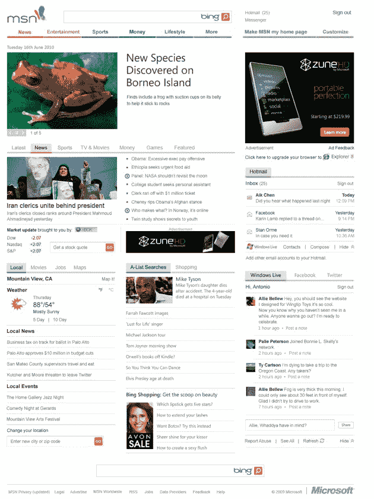
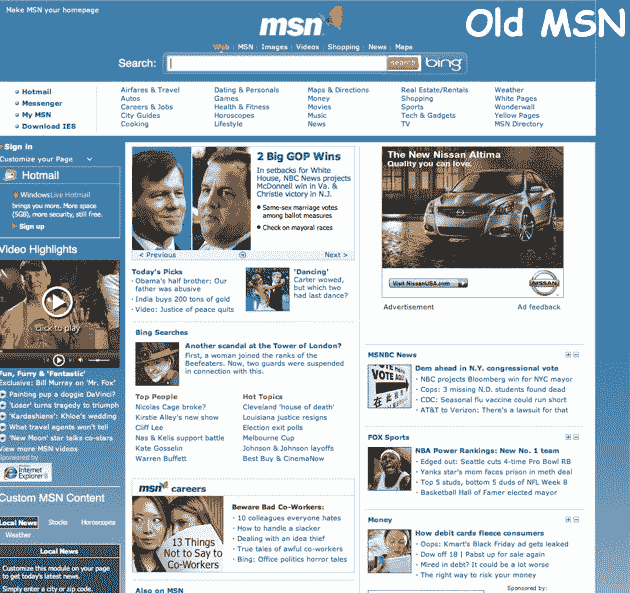

# MSN Redux。明显少了蓝色。但是增加了脸书和推特！

> 原文：<https://web.archive.org/web/https://techcrunch.com/2009/11/03/msn-redux-significantly-less-blue-but-with-added-facebook-and-twitter/>

# MSN Redux。明显少了蓝色。但是增加了脸书和推特！

全球超过 1/3 的互联网用户每月都会访问 MSN 。4 亿人。这远远超过了 AOL 的 8000 万，也不至于超出雅虎的近 6 亿。但是，它仍然是最受欢迎的互联网门户，没有人真正去过。从今晚开始，这种情况将会改变。或者至少，MSN 在改变。我们将不得不等待，看看使用量会受到怎样的影响。

最显著的变化是一个新的标识和更少的蓝色(下面是旧 MSN 的截图供后人参考)。一切都更流畅，更容易阅读。链接没那么多。更多视频(使用 Silverlight 的热门高清内容)。许许多多的必应和 Live.com 服务。

当然，还有脸书。还有推特。

在 MSN 的右下方登录。微软表示，他们每月访客的一半已经是脸书用户。15%的人使用 Twitter。因此，能够直接从门户页面阅读和创建脸书和 Twitter 消息是一个好主意。对于使用 Silverlight 的用户，将提供更多高级应用。

微软将逐步推出新版本。但是如果你现在就想进去，而且绝对等不及排队，你可以马上去 http://preview.msn.com 的[看一看。](https://web.archive.org/web/20230216121810/http://preview.msn.com/)

