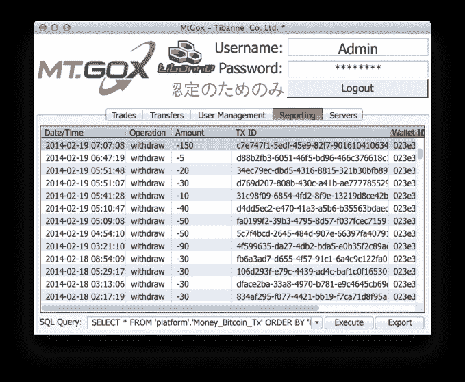

# Mt.Gox Hack 涉嫌泄露比特币余额、客户账户总数 

> 原文：<https://web.archive.org/web/https://techcrunch.com/2014/03/09/mt-gox-hack-allegedly-reveals-bitcoin-balances-customer-account-totals/>

# Mt.Gox Hack 涉嫌泄露比特币余额、客户账户总数

匿名黑客篡改了 Mt.Gox 首席执行官 Mark Karpeles 的博客，并上传了客户数据的数据转储，据该网站用户称，这些数据是准确的。一个 Reddit 用户创建了一个 Excel 电子表格[【镜像】](https://web.archive.org/web/20221207064432/https://letscrate.com/f/johnbiggs/mt-gox/xls-file/mtgox_balancies.xlsx.zip)匿名用户账户余额，许多当前 [Mt.Gox](https://web.archive.org/web/20221207064432/https://beta.techcrunch.com/tag/mt-gox/) 用户发现他们的余额存在。

帖子的内容是[NSFW]:

***保存这篇文章，镜像文件，转发，分享并保持这些数据可用* * *
http://blog . magic altux . net/WP-content/uploads/2014/03/mtgox 2014 leak . zip
http://89.248.171.30/MtGox2014Leak.zip
首先也是最重要的，这不是马克·卡佩莱斯。去他妈的婊子养的混蛋。
是时候让 MTGOX 而不是比特币社区愤怒了。这个版本本来会更快，但本着负责任的披露精神，并确保所有的鸭子都在一条线上，它花了几天的时间比希望核实数据。在上面你会发现下载链接和一面镜子，没有征求马克·卡佩斯本人的意见。
在该下载中，您将找到相关的数据库转储、csv 导出、专用工具和一些根据数据编译的突出显示的摘要。保持与他妈的 Gox 一致，没有用户数据库转储被包括在内。在这些信息消失之前，转发并分享它们。包括我们在内的许多人丢失了钱和硬币。投票支持这篇文章。我们没有偷比特币。没有可偷的东西。如果你想捐款，你可以在这里发币让我们吃饱了披萨和啤酒，1859 rayqn 1 x 7 dy JD 1 brahm 4 vaqxouhzsn。
按币种统计所有用户的余额总和。

【t！
币种:加元余额:320，184.36558
币种:瑞士法郎余额:99，487.07308
币种:CNY 余额:297，775.78994
币种:DKK 余额:112，264.56207
币种:欧元余额:5，634，625.59531
币种:英镑余额:921

显然，最重要的数字是 951，116.21905382 余额。正如你所记得的，Mt.Gox [申请破产，同时声称亏损 85 万 BTC。这表明卡普莱斯的估计误差很大。所有这些是否准确是一种完全不同的方式。这次泄露向我们展示了获取 Mt.Gox 的几乎所有用户数据是多么容易，以及 Karpeles 的博客是多么顽固。此外，这些文件包含用于管理传输的应用程序 Mt.Gox admins。下面出现一个屏幕截图。](https://web.archive.org/web/20221207064432/https://beta.techcrunch.com/2014/02/28/mt-gox-files-for-bankruptcy/)

谁黑了 Mt.Gox？这个漏洞包含了一些线索。访问上面提到的镜像会带来一个 zip 文件的链接和一个注释:“我讨厌和你一起工作。你所做的一切都是你应得的。”