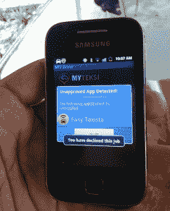

# 马来西亚的打车应用在幕后互相诽谤，一决雌雄

> 原文：<https://web.archive.org/web/https://techcrunch.com/2013/06/20/mud-slinging-behind-the-scenes-as-malaysias-taxi-apps-duke-it-out/>

在马来西亚，出租车司机正在争夺土地，打车应用初创公司积极瞄准少数渴望跳上数字平台的出租车司机。

成立两年的出租车预订初创公司 MyTeksi 一直忙于招募出租车司机加入其服务。两周前，当我参观其办公室时，MyTeksi 的产品和营销主管 Aaron Gill 表示，该公司在过去 6 个月里加大了说服司机购买智能手机和数据套餐的力度。

它不得不出售与允许司机接受工作的服务挂钩的好处，而不是不得不开车在路边寻找乘客。

到目前为止，MyTeksi 已经招募了大约 2500 名司机，覆盖首都吉隆坡以及普特拉贾亚、雪兰莪和森美兰州。该平台每 8 秒钟收到一个订单，即每天 1 万个订单，每天为公司带来约 3100 美元(1 万 MYR)的净收入。

几个竞争者也加入了竞争: [Hopcab](https://web.archive.org/web/20230320020137/http://hopcab.com/) 和 [TaxiMonger](https://web.archive.org/web/20230320020137/http://www.taximonger.com/pages/about) 去年推出。

但是在过去的一个月里，当 Rocket Internet 在该国首次推出其 Easytaxi 服务时，事情才真正开始升温。

自 Easytaxi 推出以来，一直有传言称，其员工会接近贴有 MyTeksi 标志的出租车，让他们转而乘坐 Easytaxi。接近两家公司的消息人士表示，Easytaxi 的员工还帮助删除了司机手机上的 MyTeksi 应用程序，代之以 Easytaxi 的应用程序。

Rocket Internet 的董事总经理 Joon Chan 几乎没有否认这些谣言。“司机可以在手机上随意使用任何应用程序。这是唯一公平的，因为他们为自己的手机和数据计划付费，”他说。

他补充说，该国只有约 10%至 15%的司机拥有智能手机，这表明可寻址的司机群体甚至更小。

但 MyTeksi 可能正在部署自己的反竞争策略。Chan 出示了一张 MyTeksi 应用程序的照片，显然是在提示司机删除 Easytaxi 应用程序。

Chan 说，Easytaxi 于 5 月 12 日开始招募司机，并在加油站设立了招募站来招募司机。他说，这家初创公司正在快速扩张——在过去的一个月里，每周都会增加五名新员工。

MyTeksi 的 Gill 在评论 Rocket 进入其空间时说:“他们让我们变得更好，更敏锐。我们正在以更快的速度扩大我们的车队，提高我们的服务水平，并将继续努力保持我们的优势。

“如果像 Rocket Internet 这样资金充足、经验丰富的组织发现这个空间值得他们花费时间和投资，那么我们一定是在做正确的事情。”

MyTeksi 正在筹集其 A 轮资金，并刚刚扩展到马尼拉。在 Rocket Internet 的支持下，Easytaxi 服务现在已经覆盖了 10 个不同的国家。

**打车应用的差距**
马来西亚出租车司机不太出名的名声为出租车应用创造了机会。

一份 2008 年的调查显示，马来西亚的出租车是世界上最差的。和[的其他描述](https://web.archive.org/web/20230320020137/http://thestar.com.my/news/story.asp?file=/2012/10/7/nation/12137997&sec=nation)的错误行为[继续](https://web.archive.org/web/20230320020137/http://www.tripadvisor.com.sg/Travel-g298570-c19084/Kuala-Lumpur:Malaysia:Errant.Kl.Taxi.Drivers.html)出现在媒体上，表明这从那以后就没有改变过。

两周前我在那里的时候，我标记的大多数出租车都坚持收取统一的(而且明显更高的)费用，拒绝使用官方的计价器。一些当地人说被出租车司机欺骗甚至抢劫仍然是这个国家的一个问题。

吉尔表示，打车应用程序一直在帮助监管司机，让他们注册这项服务，并允许他们在出行时被跟踪。

促成这一机会的另一个因素是，在马来西亚没有与任何大型出租车公司竞争。例如，在新加坡，主要的出租车运营商 [ComfortDelGro](https://web.archive.org/web/20230320020137/http://comfortdelgro.com.sg/) 为其车队开发了一款应用程序，覆盖了当地超过 50%的市场。然而，马来西亚的大多数出租车仍然依靠无线电传输来呼叫工作。唯一开发了应用程序的出租车运营商似乎是[阳光出租车](https://web.archive.org/web/20230320020137/http://www.sunlighttaxi.com/)，但它只有大约[10%的市场份额。它的应用程序是今年发布的。](https://web.archive.org/web/20230320020137/http://www.motorolasolutions.com/web/Business/_Documents/APAC/Case-Studies/_Static-Files/2007_CONVENTIONAL_RADIO_SYSTEM_Transportation.pdf)