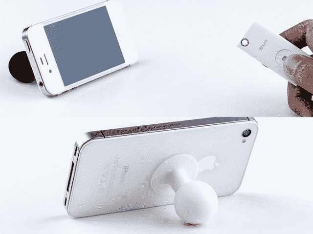

# Muku Labs 的 Shutter 是一款用于智能手机相机的微型蓝牙遥控快门

> 原文：<https://web.archive.org/web/https://techcrunch.com/2013/07/17/muku-lab-shuttr/>

智能手机自拍的种类非常有限:让你的头部看起来膨胀的臂长照片和模糊的镜子照片。有几个自拍应用程序，但仍然很难拍出自然的自拍或自发的集体照，特别是如果你还试图与小孩和宠物争吵的话。现在在 Kickstarter 上，[shutter](https://web.archive.org/web/20221005062902/http://www.kickstarter.com/projects/68008805/muku-shuttr-slimmest-remote-camera-control-for-sma)是一款用于 iOS 和 Android 设备的微型蓝牙遥控快门，由总部位于香港的 [Muku Labs](https://web.archive.org/web/20221005062902/http://www.mukulabs.com/) 开发，让智能手机摄影师有更多的控制权。它已经达到了融资目标，但将于秋季开始发货的遥控器仍然可以从 29 美元起购买。

Shuttr 是由香港工程师 Kevin Leung 创建的。当梁还是个小孩子的时候，他的家庭买不起照相机，因此他没有在蹒跚学步之前拍摄的家庭照片。梁振英的母亲在他十几岁的时候就去世了，这让他更加决心尽可能多地捕捉妻子和年幼女儿的快照。

当他找不到自己喜欢的智能手机遥控快门时，梁感到很沮丧。与朋友的交谈让他意识到，还有很多人想要拍出更好的集体照和自拍。

“我辞掉了工作，去制造我认为市场上缺少的遥控快门，”梁通过电子邮件告诉我。这位牛津大学 MBA 毕业生与电子工程师郑海、工业设计师陈、生产工程师汤姆赵和物流专家合作，花了一年时间开发 Muku Shuttr。

6 毫米厚的 Shuttr 小到可以藏在你的手里拍照，还可以放在钥匙链上。遥控器的范围约为 30 英尺，不需要视线，这意味着你可以在口袋里使用 Shuttr。

Shuttr 在几个方面与 Belkin 和 Satechi 等制造商的竞争产品有所不同。它更小，更便宜，通常不需要应用程序来与智能手机配对(尽管 Shuttr 应用程序可用于旧版本的 iOS 或某些 Android 设备，如新的 HTC One)。该遥控器兼容所有 iOS 设备，三星 Galaxy S3 和 S4，Note 2 和 Tab 10.1，LG Nexus 4 和许多其他 Android 4.1+设备，具有蓝牙 3.0+。它还可以与 iOS 应用 Camera+和 645 Pro 配合使用，所以你可以绕过 iPhone 的内置摄像头。

“我们在测试几乎所有可用的蓝牙芯片组时进行了大量的反复试验，以找到最兼容的芯片组，并对这些固件进行微调，以最大限度地提高兼容性和稳定性，”Leung 说。" Shuttr 在我们批准的模式下经过了如此严格的测试，我们有信心可以推出."

Shuttr 是 Muku Labs 开发的第一款产品，Leung 表示，该公司将继续开发增强智能手机拍照过程的产品。该团队目前正在规划一系列卡扣式镜头。

“我们知道市场上已经有很多这样的产品，”Leung 说。“但我们知道，我们可以通过质量击败他们。”