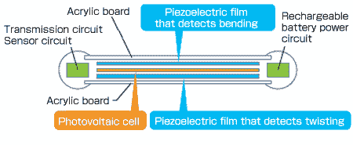
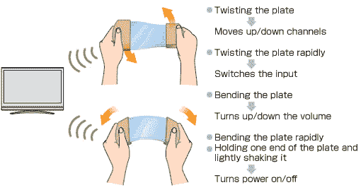

# 村田的灵活遥控器让您可以通过弯曲和扭转动作来控制电视 TechCrunch

> 原文：<https://web.archive.org/web/http://techcrunch.com/2011/09/23/muratas-flexible-remote-lets-you-control-your-tv-with-bending-and-twisting-motions/>

# 村田的灵活遥控器让您可以通过弯曲和扭转动作来控制电视

日本科技公司[村田](https://web.archive.org/web/20230204112721/http://www.murata.com/)与[关西大学](https://web.archive.org/web/20230204112721/http://www.kansai-u.ac.jp/English/index-e.htm)和[三井化学](https://web.archive.org/web/20230204112721/http://www.mitsuichem.com/)合作，开发出一种不需要用户按键的[遥控器](https://web.archive.org/web/20230204112721/http://www.murata.com/new/news_release/2011/0921/index.html)。相反，电视或其他电器可以通过以各种方式弯曲和扭转遥控器来控制。

该设备目前的原型名为“Leaf Grip 遥控器”，本质上是一种新型人机界面的推广。

村田解释道:

> 这种遥控器有一个非常新的概念设计，使它能够通过弯曲和扭曲压电薄膜制成的板来检测这种运动。此外，它使用颜料在接收光线时释放电子，并与光伏电池组装在一起，将光转化为电，为其提供无电池功能。

如何使用该设备的示例:

Leaf Grip 遥控器使用新开发的压电薄膜，这种薄膜高度透明、有机且不含热电，这意味着用户可以操纵它——无需电池。

该公司计划在下个月的 2011 年日本 CEATEC 展会上展示基于这部新电影的遥控器和其他设备。