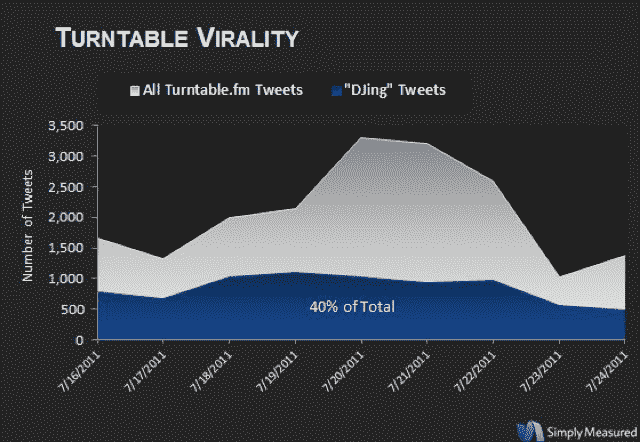

# 在音乐推文之战中，Turntable.fm 比 Spotify 或 Pandora TechCrunch 拥有更多的 Klout

> 原文：<https://web.archive.org/web/https://techcrunch.com/2011/07/28/music-tweets-spotify-turntable-fm/>

# 在音乐推文的战争中，Turntable.fm 比 Spotify 或 Pandora 有更多的 Klout

你有没有注意到最近提到 Spotify、Turntable.fm 或其他音乐服务的推文数量有所上升？这是他们邪恶计划的一部分。在线音乐服务的生死取决于口碑，这就是为什么大多数在线音乐服务都与 Twitter 和脸书挂钩，让用户分享邀请和他们正在听的歌曲。但是，在这场音乐推特之战中，哪些人会胜出呢？

社交媒体分析公司[简单测量了](https://web.archive.org/web/20230204235735/http://simplymeasured.com/)一周内链接到三个音乐服务之一的推文样本:Spotify、Turntable.fm 和 Pandora。它发现 51%的推文链接到 Spotify，26%链接到 Turntable，23%链接到 Pandora。所以乍一看，Spotify 似乎占据主导地位。但如果你去掉邀请推文，情况就完全不同了。自从几周前 [Spotify 在美国](https://web.archive.org/web/20230204235735/https://techcrunch.com/2011/07/14/heres-spotify-the-music-streaming-service-officially-lands-in-the-us/)推出以来，人们已经在 Twitter 上发布了大量邀请链接。除去这些，它在剩余推文中的份额只有 2%。Turntable 以 52%的点击率高居榜首，Pandora 以 46%的点击率紧随其后。

这一数据表明，转盘调频仍然是一个非常强大的[早期采用上瘾。](https://web.archive.org/web/20230204235735/https://techcrunch.com/2011/06/08/turntable-addiction/)它也仍处于有限的测试阶段。然而它的用户比潘多拉的用户发的微博还多。转盘用户分享他们 DJ 的歌曲，其 40%的推文属于这一类别。

最后，转盘用户的 Klout 平均得分为 34 分，相比之下，潘多拉用户为 32 分，Spotify 为 29 分，这表明其用户在 Twitter 上更具影响力，至少根据 [Klout](https://web.archive.org/web/20230204235735/http://klout.com/home) 的说法是如此。

