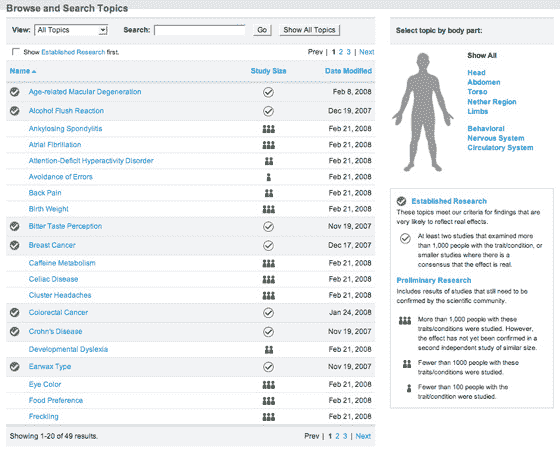
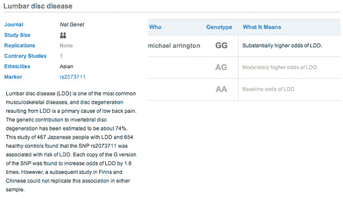
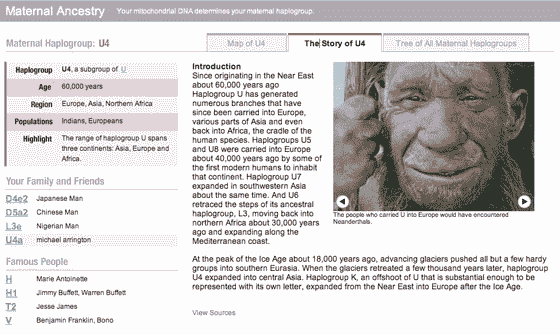
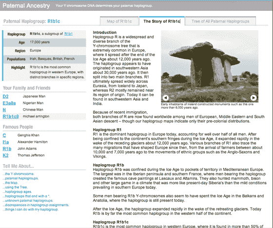

# 我的 23andMe DNA 结果 

> 原文：<https://web.archive.org/web/https://techcrunch.com/2008/03/02/my-23andme-dna-results/>

 我在 12 月买了一个 1000 美元的 [23andMe](https://web.archive.org/web/20230219212849/http://www.23andme.com/) DNA 测试，当试剂盒到达时把[吐在试管里](https://web.archive.org/web/20230219212849/https://techcrunch.com/2007/12/16/23andme-step-2-spitting-in-a-tube/)，仅仅几个星期后就拿到了结果。是的，可惜我没有等上一个月，我本来可以免费得到一个工具包，但是一个幸运的读者却得到了一个。

我承诺发布结果，这样人们就可以了解 23andMe 提供了什么(无需支付费用)，结果就在这里。此外，从上周起，23andMe 开始允许用户创建免费的模拟账户。如果你创建了一个，加我的用户名 TechCrunch 为好友，我可以直接与你分享数据。

结果如下:

**遗传性状**

一旦你有了测试结果，你就可以在基因杂志上看到它们。随着时间的推移，23andMe 正在增加更多关于你的基因图谱的信息(他们上周增加了 30 多种特征，包括父系血统)。下面是截图:

有些信息只是为了好玩——例如，我有“湿耳垢”,没有“酒精脸红”基因，当人们喝酒时，他们的脸会变红。我不像有些人那样能察觉气味。更没用的是，23andMe 通知我有棕色眼睛。我有一个让人长高的基因(我身高 6 英尺 4 英寸)。我不喜欢吃甜食。

然后是更严重的事情。事实证明，我有一种基因，使我更有可能患有下背痛(这种病困扰了我父亲一生，但迄今为止没有困扰我):

我患 1 型糖尿病的几率高于正常水平，但患 2 型糖尿病的几率低于正常水平。我患前列腺癌和类风湿性关节炎的几率低于平均水平。我没有使一些人对艾滋病产生抵抗力的遗传物质，尽管我有一种使艾滋病发展更慢的基因。我在基因上对疟疾没有抵抗力。我略微提高了内存性能。

**血统**

在我母亲这边，我的祖先来自欧洲、亚洲和北非。在我父亲那边，有一种常见的欧洲基因，存在于爱尔兰人、巴斯克人、英国人和法国人身上(我大部分是欧洲人，部分是美洲土著人)。显然，我和我父亲的约翰·亚当斯有一些共同的基因。顺便说一下，我的母亲和他们一样白——但也许那张照片是她的祖先之一。

结果中包含了更多的信息，我很乐意与读者分享。只需创建一个演示帐户，并添加 TechCrunch，我相信你会获得这些数据。