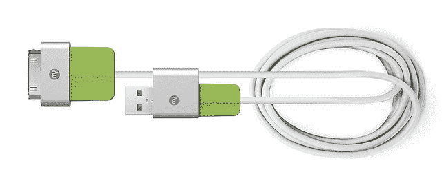
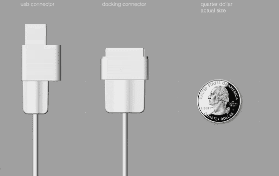

# MySaver 让你的 iPhone 线缆第 100 次不会断裂 

> 原文：<https://web.archive.org/web/http://techcrunch.com/2011/08/09/mysaver-fix-fraying-iphone-cable/>

# MySaver 让你的 iPhone 线缆第 100 次不会断

苹果在很多方面都做得非常好。电缆……不在其中。直到苹果彻底检修他们的笔记本充电器到这个最新版本，我每 3-4 个月就会不经意地毁掉一个——但这和我咬坏的 iPhone 电缆相比根本不算什么。真的:我可能会用我那堆退役的 iPhone 电缆给你织一顶非常僵硬、不舒服的帽子。

我想我只是对我的电缆特别苛刻——毕竟，我经常旅行。原来，我不是唯一一个。仅仅过了一周左右，Kickstarter 上一个超级简单的 iPhone 电缆保护器项目就已经找到了一大批受人尊敬的支持者。

对于那些*没有*必须处理自毁的 iPhone/iPad/iPod 电缆的人来说，问题来了:它们会磨损。不好。这只是关于终端连接器(无论是坞站侧还是 USB 侧)与电缆屏蔽的设计问题。几个星期后(当然，有很多被包装和推出；如果你只是一直把它放在你的桌子上，你的电缆可能是完好无损的)，它们开始分离；再过几个星期，电线就大部分露出来了。几个月之内，电线可能会断了。苹果已经对这些电缆的设计做了几次微妙的改变，但问题似乎从未真正消失。

这个 Kickstarter 项目，[“my saver”](https://web.archive.org/web/20230203062858/http://www.kickstarter.com/projects/1499810396/mysaver-protection-for-your-ipad-iphone-and-ipod-c)，通过……嗯，让末端连接器吸得更少来解决这个问题。通过将整个末端包裹在柔软、有弹性的硅中，并增加端盖的尺寸，MySaver 减少了连接器薄弱点的应力。

MySaver 有两种风格:一种是针对现有 iPhone 电缆的 DIY、卡扣式解决方案，他们希望零售价为 11 美元(Kickstarter 支持者以 8 美元购买)，另一种是预制的替代电缆，他们计划售价为 25 美元(支持者以 19 美元购买)。早期支持者以 10 美元的价格获得了它，尽管该层现已售罄。)

觉得我对我的电缆太苛刻了吗？在启动后的短短一周内，该项目已经找到了 274 名支持者，并筹集了 15，000 美元的目标中的 7，500 美元。虽然这没有像抖音的纳米手表那样荒谬的压倒性胜利，但这肯定是比大多数项目更好的开始。

准备好花点钱来结束这场争吵了吗？你可以在这里找到 Kickstarter 项目。

(说了这么多，让我们不要停止希望苹果在不久的将来兑现他们支持 microUSB 的承诺)