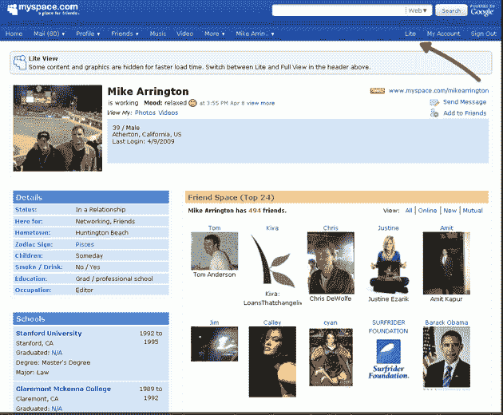

# MySpace“精简版”缩小了臃肿的个人资料页面 

> 原文：<https://web.archive.org/web/https://techcrunch.com/2009/04/13/myspace-lite-brings-bloated-profile-pages-down-to-size/>

# MySpace“精简版”缩小了臃肿的个人资料页面

[MySpace](https://web.archive.org/web/20230130094324/http://www.myspace.com/) 用户今天下午注意到他们的导航条上有一个新按钮，允许他们在网站传统的“完整”视图和一个名为“精简”的新视图之间切换，这个新视图去掉了网站简介中众所周知的定制和媒体。当被联系到发表评论时，MySpace 证实他们今天已经在美国悄悄测试了“Lite”功能，解释说该产品主要面向无法接入宽带连接的成员，这是国际用户的常见问题。该产品已于过去几天在印度上市，并将于本周晚些时候向美国会员推出(接下来几周将会有更多的国际支持)。

MySpace 长期以来一直强调允许用户用富媒体内容定制他们的个人资料(这个功能偶尔会被一些过于热心的用户滥用)。许多 MySpace 成员在他们的个人资料中包括 YouTube 剪辑、音乐播放列表和华丽的照片幻灯片，这可能会使页面在试图通过慢速互联网连接浏览 MySpace 时几乎无法使用，特别是因为许多这些文件必须从 MySpace 无法控制的服务器上加载。有了 MySpace Lite，这些问题就不是问题了。

Profile Lite 中不包括的元素有“关于我”和“我想见的人”部分、用户兴趣、评论和第三方应用程序。这听起来可能很多，但用户仍然可以查看大多数个人信息，如关系状态、朋友和状态消息。该公司表示，当 Profile Lite 面向所有人推出时，它还将包括该网站的音乐模块(可能不像视频内容那样占用大量带宽)，但大多数其他媒体将被排除在外。Profile Lite 的未来版本可能会包含精确定制哪些配置文件框应该以“Lite”模式显示的功能。

MySpace 可能是在向国际用户和拨号用户推销“精简”的个人资料，但它有一个潜在的更深远的影响:它让用户能够用一个单一的、统一的界面浏览 MySpace。脸书相对于 MySpace 的一个长期优势是其干净、结构化的外观——脸书允许少量的定制，但用户总是知道当他们想找到一个成员的简历或朋友名单时去哪里找，而在 MySpace 上并不总是这样。诚然，一些 MySpace 用户被吸引到这个网站是因为他们*希望*能够加载他们的电影和照片，但我们大多数人至少喜欢选择忽略这些内容。现在，MySpace 给了我们一种方法来做到这一点，即使他们并不急于以这种方式推广它。