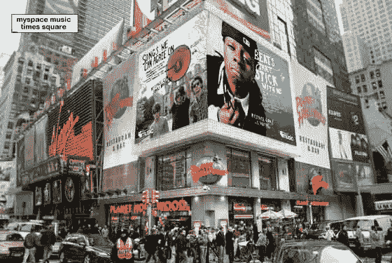
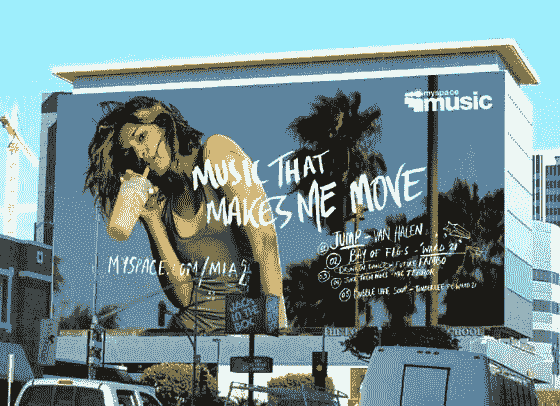
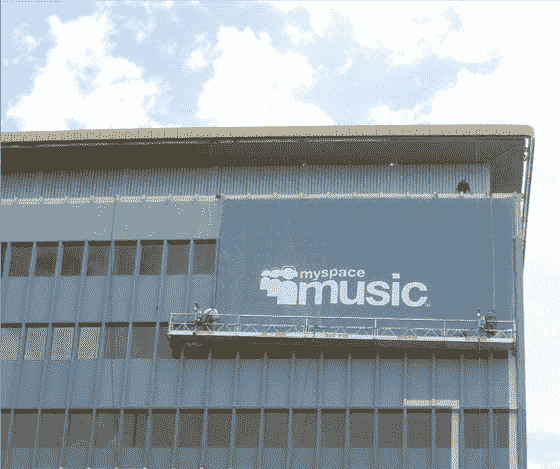
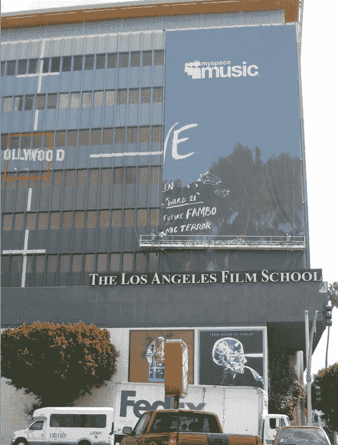

# MySpace 音乐广告牌在纽约洛杉矶竖起 TechCrunch

> 原文：<https://web.archive.org/web/https://techcrunch.com/2008/09/16/myspace-music-billboards-go-up-in-los-angeles-new-york/>

# MySpace 音乐广告牌在纽约洛杉矶竖起

看起来 MySpace 肯定会在下周与主要唱片公司的 [MySpace 音乐合资公司](https://web.archive.org/web/20230216125450/https://techcrunch.com/2008/09/14/myspace-music-already-has-revenue-locked-may-raise-outside-capital-at-2-billion-valuation/)的发布会上花费大量现金。第一次广告闪电战袭击了洛杉矶(日落好莱坞)和纽约(时代广场)。广告牌上有艺术家李尔·韦恩、M.I.A .和乔纳斯兄弟等人。

MySpace 不愿评论这些广告牌的成本，也不愿透露此次发布的总市场预算。有没有广告买家愿意推测一下这些广告的价格？

上面的前两张图片是 MySpace 提供的模型，展示了广告牌的样子。第三和第四张是今天一位读者为我们拍摄的洛杉矶广告牌的真实照片。

没有消息表明 MySpace Music 将会在旧金山投放广告。

第一个拍到明天纽约广告牌的 TechCrunch 读者将会得到一件 TechCruncht 恤和一个大大的感谢。