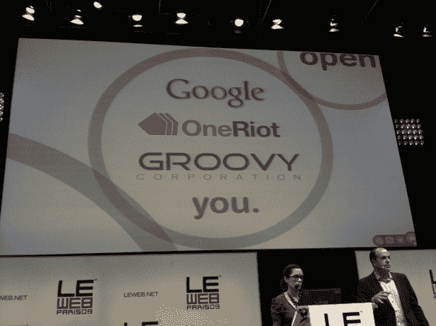
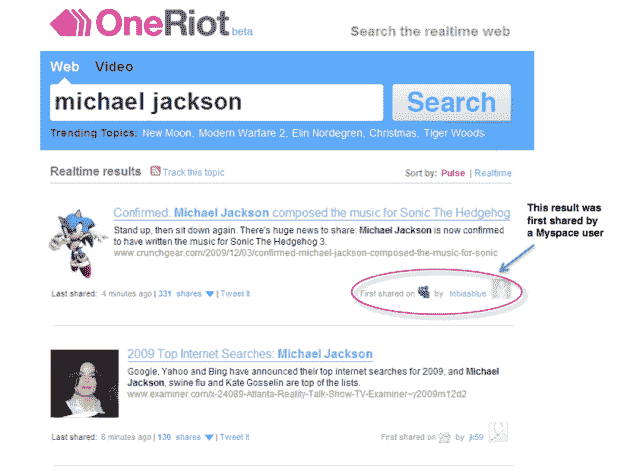

# MySpace 与 Google、OneRiot 和 Groovy | TechCrunch 推出了一套新的实时 API

> 原文：<https://web.archive.org/web/https://techcrunch.com/2009/12/09/myspace-realtime-api-google-oneriot-groovy/>

 [MySpace](https://web.archive.org/web/20230305231423/http://myspace.com/) 今天发布了[全新的 API 套件](https://web.archive.org/web/20230305231423/http://developer.myspace.com/)，这将允许第三方开发者实时、动态地利用社交网络上发布的大量数据。今天早上，MySpace 首席运营官[迈克·琼斯](https://web.archive.org/web/20230305231423/http://www.crunchbase.com/person/mike-jones)在 Le Web 大会的舞台上首次展示了一套新的 API，展示了来自发布合作伙伴的一些初始服务。

今天亮相的最重要的一个是实时流 API，它允许将完整的 MySpace 活动流实时推送到第三方网站和应用程序。该 API 包括粒度过滤器，允许开发人员利用它对推出的数据量进行完全控制。

谷歌和实时搜索公司 [OneRiot](https://web.archive.org/web/20230305231423/http://www.oneriot.com/) 是两家发布合作伙伴，他们将利用 MySpace 的 fresh Stream API，使搜索巨头和初创公司能够吸收数据，如状态更新、音乐、视频、照片等，以包含在搜索结果中。

你可能还记得谷歌[在周一宣布了它的实时搜索计划](https://web.archive.org/web/20230305231423/https://techcrunch.com/2009/12/07/google-realtime/)，并且他们已经表示将会“很快”包括[公开的 MySpace 数据。还没有确切的日期，但我们被告知将于下个月实施。正如我们最近发现的，OneRiot 已经为雅虎和微软这样的公司提供了实时搜索功能。](https://web.archive.org/web/20230305231423/https://techcrunch.com/2009/12/07/myspace-google-realtime/)

OneRiot 已经将 MySpace 的活动流数据整合到了它的搜索引擎中，所以现在就去看看吧，或者看看下面的截图。

第三个合作伙伴， [Groovy](https://web.archive.org/web/20230305231423/http://www.groovycorp.com/) ，正在利用其强大的[关系数据管理软件](https://web.archive.org/web/20230305231423/https://techcrunch.com/2009/07/22/groovys-sql-switch-a-powerful-tool-in-the-quest-for-a-truly-real-time-web/)在 MySpace 上推出一个漂亮的公共时间轴应用程序，名为 [GroovyChannel](https://web.archive.org/web/20230305231423/http://www.myspace.com/groovychannel) 。

新的 MySpace APIs 全部免费使用，不受限制，并且基于开放标准。
除了实时流 API，它们还包括:

**状态和情绪评论 API**

使第三方开发者能够获取 MySpace 的状态和心情更新，并允许人们在不离开的情况下对来自这些网站的信息流进行评论和互动。

**打开搜索 API**

允许第三方网站在搜索结果中包含公开的 MySpace 个人资料信息。用户将能够通过姓名、个人资料类型或电子邮件地址搜索人员，并根据性别、年龄和地点过滤搜索结果。

**照片上传 API**

允许用户从第三方网站或 MySpace 应用上传照片到 MySpace。该 API 支持创建公共或私人相册。

**在 MySpace 上发布/分享的更新版本**

方便与 MySpace 用户的朋友分享来自第三方网站的内容。当用户发布来自另一个网站的内容时，它会直接进入他/她的 MySpace 活动流，创建一个返回第三方网站的链接。

为了鼓励开发者开发新的应用程序，MySpace 还宣布了一项竞赛，旨在奖励以最有趣的方式使用新 API 的开发者现金奖励(5 万美元)和在社交网络上的推广。它从 1 月 4 日开始。

MySpace 的举动正好符合首席执行官[欧文·范·纳塔](https://web.archive.org/web/20230305231423/http://www.crunchbase.com/person/owen-van-natta)在 Web 2.0 峰会上的讲话(即[“内容社会化”](https://web.archive.org/web/20230305231423/https://techcrunch.com/2009/10/21/web-2-0-summit-v-for-van-natta/))。

问题仍然是:这种比脸书今天所做的任何事情都更进一步的开放方式，是否会帮助 MySpace 保持其作为全球社交网络的相关性，甚至可能重获其主导地位？

在我看来，这种策略是 it *能够做到这些的唯一方式，但是很明显，这很大程度上取决于开发者将会提出什么。如果你写了什么酷的东西，请告诉我们。我们没有 50k 给你，但我们喜欢看*

