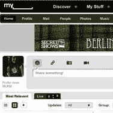
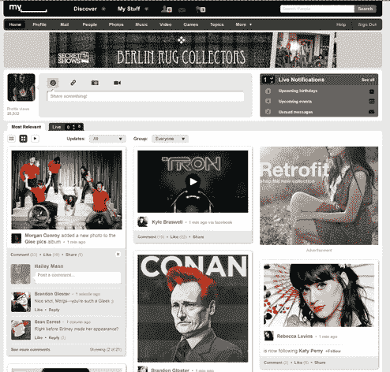
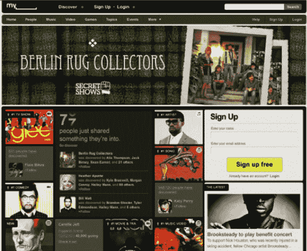
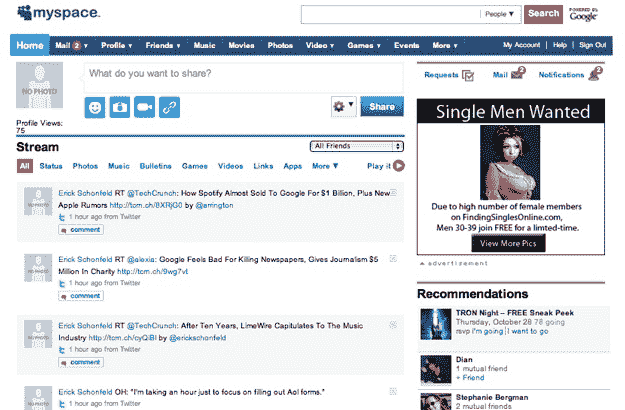

# MySpace 的重新设计就要开始了——一些细节 

> 原文：<https://web.archive.org/web/https://techcrunch.com/2010/10/26/myspace-redesign-details/>

MySpace 正准备推出期待已久的重新设计，也许最早明天，至少对新用户而言。不会有什么好看的。嗯，实际上，它非常漂亮——我看过截图——但这可能仍不足以阻止社交网络吸引力的下降。MySpace 试图向我们简要介绍禁运下的新设计[，我们不这样做，所以我们拒绝了简报。尽管如此，我们还是不断从各种渠道获得零星的信息。](https://web.archive.org/web/20221006141630/https://beta.techcrunch.com/2010/02/25/i-will-honor-the-embargo/)

让我来给你描述一下。该设计将在顶部采用[新的 MySpace 标志](https://web.archive.org/web/20221006141630/https://beta.techcrunch.com/2010/10/08/new-myspace-logo/)，并围绕发现和分享媒体——音乐、照片和视频。当你登录时，一个大的状态栏会提示你“分享一些东西！”这可以是状态信息、链接、照片或视频。

与 MySpace now 一样，它也强调分享音乐、视频和游戏。通过分享这种媒体，你成为了你朋友的社交过滤器和时尚制造者。有很多朋友的人可以成为音乐和其他媒体的社交推动者，新的设计似乎是为了突出和奖励那些人。

新的 MySpace 比现在更干净、更有条理。新设计不再是线性的活动流，而是被分解成更多的小块，或者至少是一个视图。你的朋友正在分享的内容流是其中之一，但也有你正在关注的视频、名人和音乐人以及大量照片广告的磁贴。这些磁贴让我想起了现在流行于 Pulse 和 Flipboard 等 iPad 应用中的外观。

当然也有一个实时主题。您可以在与您“最相关”和“实时”更新之间切换。顶部的另一个实时通知框显示即将到来的事件和消息。如果你没有登录，新主页将显示人们正在分享的东西的滚动计数器，以及推广专辑、电视节目、名人和人们正在发现的趋势项目的磁贴。

总的来说，这似乎是对当前设计的改进。但是这足以让人们回到 MySpace 或者带来新的用户吗？如果你所有的朋友都在脸书，他们不会在 MySpace 上与你分享他们的音乐。通过专注于媒体分享和监管，也许它可以在社交网络的等级秩序中重新找到自己的位置。

**新聚友:**

**当前/旧的 MySpace:**

