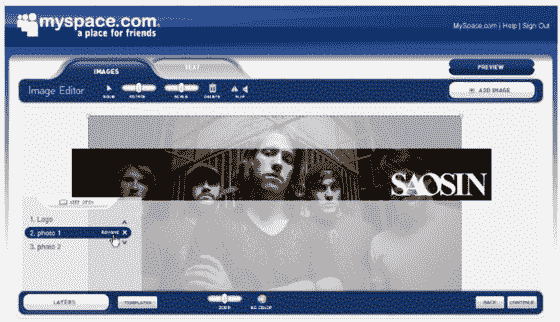

# MySpace 宣布推出自助式超定向广告网络 TechCrunch

> 原文：<https://web.archive.org/web/https://techcrunch.com/2007/11/04/myspace-to-announce-self-serve-advertising-network/>

# MySpace 宣布推出自助式超级定向广告网络

T2:MySpace 将在周一的 Ad:Tech 上宣布推出一个新的广告平台“MySpace 自助服务”。这项服务本身将在未来 60 天内向有限的广告客户推出。

去年签署的价值近 10 亿美元的谷歌搜索交易并没有受到这个产品的影响。谷歌只处理搜索和文本广告；新的 MySpace 平台用于在个人资料页面上显示广告。

MySpace 的 SelfServe 将允许广告商在整个 MySpace 网络中直接购买、创建(见下面的屏幕截图)和分析广告的表现，其方式类似于 Google Adwords(尽管 MySpace 平台是用于构建显示广告，而不是文本广告)。MySpace 将是第一个宣布此类广告产品的大型社交网站，脸书称将于周二宣布类似的服务。

新工具将使用户能够从许多广告定位因素中进行选择，如地理、人口统计和各种用户兴趣类别。这项服务将于 2008 年初投入使用。最小广告购买金额为 10 美元；定价将基于广告客户档案的点击，一旦开始，将基于拍卖(首先，MySpace 将根据类别收取固定的每次点击费用)。

MySpace 表示，美国有 2300 万家小型和本地企业(引用政府统计数据)，其中只有大约 100 万家在网上做广告，而那些做广告的企业通常只通过搜索做广告(谷歌、雅虎、微软)。MySpace 表示，大约有 1000 万商家在这项服务上保留了个人资料。该产品的目标是为这些企业提供一种接触社区的新方式。

MySpace 还将宣布完成另一个新广告平台“MySpace 超级目标”的第一阶段，该平台允许营销人员购买针对 MySpace 受众特定兴趣细分市场的广告。

MySpace 使用专有技术建立每个用户及其朋友的详细资料，包括年龄、性别、位置和兴趣。这些信息中的大部分是从个人资料本身的上下文中提取的(这就是秘方所在)。因此，举例来说，MySpace 可能有一个很好的想法，即用户不仅是一个体育迷，而且是用户热爱的特定运动以及他或她密切关注的球队甚至球员。仅电影爱好者就有 300 多个子类别。

总共有大约 1000 个类别。MySpace 表示，广告客户不需要担心目标过于具体；他们的覆盖面如此之广，以至于即使在高度目标化的水平上，仍然有大量的用户可以做广告。

广告商，包括新的自助服务平台上的小广告商，可以根据他们的喜好确定具体或一般的目标。

当广告商使用下图所示的工具制作广告时，他们可以使用 MySpace 个人资料中的任何内容来帮助快速制作。一旦广告被创建，广告商选择他们的目标类别并输入信用卡。就是这样。

这项服务于 7 月份悄然推出，目前已有约 50 家广告商使用这项服务，包括宝洁、微软、福特和塔可钟。

**更新:**我们刚刚收到界面的第一张截图。它带有完整的图像编辑功能，可以设计内置的横幅。点击查看大图。

【T2