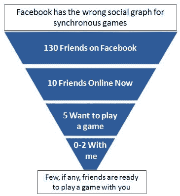
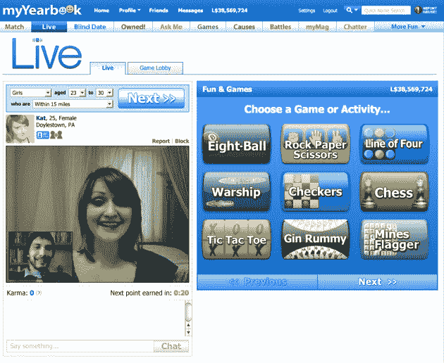

# MyYearbook 引入视频聊天实时社交游戏 

> 原文：<https://web.archive.org/web/https://techcrunch.com/2010/11/29/myyearbook-realtime-social-gaming-video/>

总的来说，到目前为止，社交网络的主要驱动力是脸书上的游戏。但是大部分这些游戏都不像假期和朋友家人玩大富翁或纸牌那样是社交游戏。MyYearbook ，这是一个小型但[盈利的](https://web.archive.org/web/20221005145242/https://beta.techcrunch.com/2009/08/25/myyearbook-finds-profitability-in-hyper-competive-social-networking-world/)社交网络，专注于更年轻的青少年用户，将试图通过让其成员同时一起玩来使在线游戏更加社交化。该网站每月有 470 万活跃访客，产生近 10 亿次浏览量。它每天有大约 100 万活跃用户，他们花三分之一的时间玩游戏和使用其他应用程序。据首席执行官杰夫·库克称，该公司通过虚拟货币和游戏内优惠赚钱，今年有望实现约 2200 万美元的收入

在 12 月中旬，myYearbook 将推出一系列新的现场游戏，将休闲游戏与现场视频聊天结合起来。这些都是基本的游戏，如军舰，金拉米，国际象棋，跳棋，四线，井字游戏。MyYearbook 还与 [OMGPOP](https://web.archive.org/web/20221005145242/http://www.omgpop.com/) (其中[专门负责](https://web.archive.org/web/20221005145242/https://beta.techcrunch.com/2010/02/24/omgpop-remakes-missile-command/)在线直播游戏) [Heyzap](https://web.archive.org/web/20221005145242/http://www.heyzap.com/) 和 [Viximo](https://web.archive.org/web/20221005145242/http://viximo.com/) 合作，将他们的一些游戏带进 myYearbook，并提供视频直播。这些都不是令人惊奇的游戏。这不是他们的目的。它们旨在让人们相互交流，结交新朋友或调情。它们是每个人都知道的游戏，每个人都可以玩。

“我们玩社交游戏是为了帮助你结识新朋友，”库克说。他在同步游戏上下了很大的赌注，这种游戏可以让在场的每个人同时玩。脸书上的大多数游戏都是*异步*——玩家们只要碰巧在线就轮流玩，游戏可能会拖上好几天。前 100 名的游戏只有 5 个是同步的。脸书有实时游戏的“错误社交图”,因为你的一个朋友现在在线*和*想和你玩游戏的可能性并不大(见右边的幻灯片)。

MyYearbook 采取了不同的方法，用游戏作为社交润滑剂，让你和不认识的人一起玩。任何时候都有更多这样的人在线。玩家将能够使用过滤器按性别、年龄和地点分类，指定他们想和什么类型的人一起玩。为了避免在视频直播中暴露自己的聊天轮盘问题，一个广泛的标记和审核系统将会到位。由于每个成员都必须登录，违规者可以被系统阻止。但是我的年鉴也雇佣了 20 个版主，这将增加到 50 个版主来管理这个系统。

库克希望避免的另一个聊天轮盘赌问题是人们不断点击下一步按钮来寻找其他玩家。玩家将根据他们玩的时间长短获得或失去因果报应点数，如果他们达到零因果报应点数，他们将在一定时间内被禁止玩游戏。

然而，要让实时游戏在我的年鉴上起飞，它需要更好的游戏。与 OMGPOP 等游戏公司和其他开发商合作是让这些游戏更具吸引力的方法。如果 myYearbook 可以成为青少年上网闲逛和玩游戏的地方，大量的开发者会想为这个平台开发游戏。

