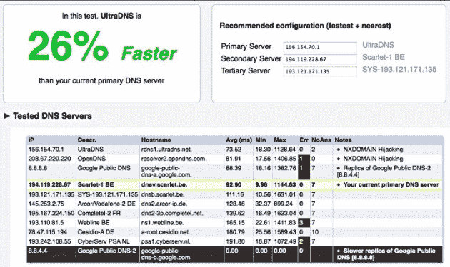
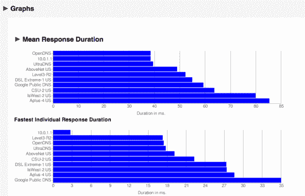
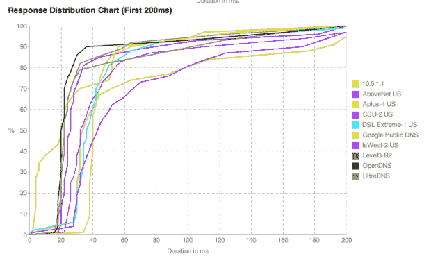

# Namebench: Google 的 20%项目，寻找最快的 DNS 服务器 

> 原文：<https://web.archive.org/web/https://techcrunch.com/2010/01/01/namebench-google-dns/>

# Namebench:谷歌寻找最快 DNS 服务器的 20%项目

当谷歌[上个月在](https://web.archive.org/web/20221006100609/http://www.beta.techcrunch.com/2009/12/03/google-dns-opendns/)推出自己的 DNS 服务时，该项目的主要目标之一就是速度。问题是大多数互联网用户不知道什么是 DNS 服务器，更不用说如何配置或测试它的速度了。但是一个谷歌人已经自己创造了一个简单的工具来测试 DNS 并推荐你用他的 20%的时间使用什么。

[来自比利时的谷歌工程师托马斯·斯特罗姆贝里](https://web.archive.org/web/20221006100609/http://twitter.com/helixblue)发明了 [Namebench](https://web.archive.org/web/20221006100609/http://code.google.com/p/namebench/) ，这是一款可以为你找到最快的 DNS 服务器的软件。这个程序可以在 OS X、Windows 和 Linux 上使用，整个程序已经被斯特罗姆贝里开源了。

一旦你安装了它，Namebench 就再容易不过了。你只需加载它，点击“开始基准”按钮，让它做自己的事情。根据您运行的测试次数(您可以设置)，它将在几分钟内返回结果。结果会在您的 web 浏览器中打开，并在顶部显示第一、第二和第三个最佳 DNS 选项。如果你想深入了解这些数字，还有许多图表。

现在，你可能会担心，既然 Namebench 是由一个谷歌人创建的，那么它将会比其他任何东西都更能促进谷歌公共 DNS 的发展。但实际上，在我刚刚运行的测试中，谷歌的解决方案从所有 DNS 产品的中间到最慢。被认为是谷歌公共域名系统最大竞争对手的 OpenDNS 实际上是最快的。

你是一个有 5 分钟空闲时间的超级用户吗？你想要更快的互联网体验吗？，”是斯特罗姆贝里在项目现场推销它的方式。如果这适用于你，你应该检查一下。几个月前，在谷歌公共 DNS 成为现实之前，斯特罗姆贝里写了更多关于这个想法的文章。

