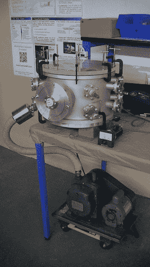

# NanoSatisfi 筹集 120 万美元，用小型廉价卫星颠覆航空业 

> 原文：<https://web.archive.org/web/https://techcrunch.com/2013/02/07/nanosatisfi-funding/>

多年来，彼得·普拉茨非常接近华尔街典型的火箭科学家——他被训练成高能物理学家，但他职业生涯的大部分时间是在金融领域度过的。但他告诉我，他一直对太空探索感兴趣，现在他正在为一家名为[nanos atifi](https://web.archive.org/web/20221213102650/http://www.nanosatisfi.com/)的航空航天初创公司工作，该公司刚刚筹集了 120 万美元的种子资金。

普拉策说，他过去回避这个行业，因为它速度慢，由政府主导，几乎没有创新。发射卫星需要花费大量的时间和金钱，这意味着这些卫星上的技术落后于地面上可用的技术。

“我们在太空中没有[摩尔定律](https://web.archive.org/web/20221213102650/http://en.wikipedia.org/wiki/Moore's_law)，”普拉茨说。

随着比卫星或微型卫星更小更便宜的纳米卫星的出现，这种情况正在改变。例如，NanoSatisfi 计划在今年发射两颗 ArduSats，每颗都是一个边长 10 厘米、重约 1 千克的立方体，它们配备有相机、盖革计数器、光谱仪、磁力计等。ArduSats 的设计使用寿命约为两年，届时它们将被采用最新技术的新卫星所取代。例如，尽管第二颗 ArduSat 卫星仅在第一颗卫星发射后几个月发射，但由于价格迅速下降，它的相机实际上将更加强大。

最终，该公司希望创建“一个定期更新的纳米卫星星座，”普拉策说。第一批卫星将用于科学实验和教育。访问卫星的费用是每周 250 美元，支持者们在 Kickstarter 上注册并为这个项目捐款。去年夏天的竞选活动超过了 35，000 美元的目标，最终筹集了 106，330 美元。该公司计划在今年夏天举办一个 ArduSat 学院，学生们可以在那里学习更多的技术，并可以竞争在第二颗卫星上进行他们的实验。

Platzer 说，nanos atifi 不仅仅专注于科学项目——一旦它将更多的卫星放置到位，nanos atifi 就可以开始向许多不同的行业出售一些“非常有吸引力的数据服务”。

在 Kickstarter 活动之后，Platzer 用自己的钱资助了这家公司。新基金是利用新的 AngelList/SecondMarket 合作伙伴关系从个人投资者那里募集的。因为是制造卫星(或者更确切地说是组装卫星，通常使用其他公司制造的组件)，我问 NanoSatisfi 是否需要一个更大的回合来真正发展公司。Platzer 说，它不应该比其他创业公司需要更多的资本——他最终 A 轮的目标是 1000 万美元。

“从字面上看，个人电脑与大型机的资本效率是相似的，”他说。

至于第一次发射，它定于 7 月 15 日，普拉茨说，这颗卫星正在进行国际空间站的补给任务之一。他说，尽管总有一些不确定性，但这些航班往往是“最安全、最有保障、戒备最森严的”

这家初创公司正在旧金山专注于硬件的 [Lemnos 实验室](https://web.archive.org/web/20221213102650/http://www.lemnoslabs.com/)中孵化——这是 Lemnos 的第一家航空航天初创公司，但 Lemnos 的联合创始人杰里米·康拉德听起来对这个行业非常兴奋，所以它可能不会是最后一家。