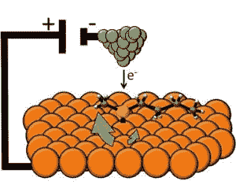

# 纳米技术电动马达由单分子制成 

> 原文：<https://web.archive.org/web/http://techcrunch.com/2011/09/06/nanotech-electrical-motor-is-made-from-a-single-molecule/>

# 纳米技术电机是由单个分子制成的

塔夫茨大学的研究人员组装了一个直径只有一纳米的“分子马达”。这不是有史以来第一个单分子马达，但这一个，不像其他的，可以通过扫描电子显微镜的微小尖端单独激活。他们正与吉尼斯合作，以获得世界上最小马达的认证。

这台小得令人难以置信的机器——尽管它真的只是一个分子(而且不是一个大分子),但它*是*一台机器——是通过简单地将丁基甲基硫化物分子堆叠在铜基底上而创建的。分子的构象最终将硫“向下”固定，在那里它充当一种枢轴，碳原子伸出两端。

加一点电，它就开始旋转。两个方向，因为在那个尺度下的事物并不总是像在牛顿世界中那样一致，但它倾向于一个方向比另一个方向更一致，这使得它是可预测的。

 他们能拿这个做什么？现在不多。这真的很酷。但研究人员指出，这是第一个这样的电动分子马达，而且可以单独激活，而另一个闲置仅几纳米远。他们通过让电荷通过扫描电子显微镜来实现这一点，扫描电子显微镜通常使用电子流作为光子类似物来创建图像。现在，电子仅仅是一种电流，一种可以精确到一次只能指向一个原子的电流。这种优势让纳米技术开发人员和工程师感到兴奋，他们几乎肯定可以使用这样的部件。

对于任何研究过微生物学的人来说，这可能看起来没什么意思。我们的身体是分子机器的家园，它们的复杂和优雅几乎令人难以置信。但即便如此，它们也不是人为设计的，很难重新利用。此外，它们中的许多依靠 ATP 或其他化学燃料运行，这几乎不可能以与扫描电子显微镜相同的精度水平应用。

这项研究发表在最新一期的《自然纳米技术》杂志上。你可以在这里阅读摘要。