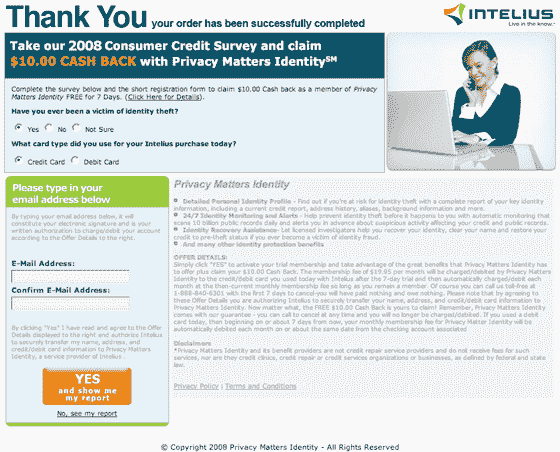

# 纳文·贾恩的最新骗局:Intelius 

> 原文：<https://web.archive.org/web/https://techcrunch.com/2008/05/29/naveen-jains-intelius-prepares-to-go-public-how-much-of-their-revenue-is-a-scam/>

 当连续创业家[纳文·贾恩](https://web.archive.org/web/20230214050829/http://www.crunchbase.com/person/naveen-k-jain)在 2002 年末不光彩地离开他创建的公司 Infospace 时，许多人认为他再也不会得到金融市场的信任了(参见《西雅图时报》的这个[三集系列](https://web.archive.org/web/20230214050829/http://seattletimes.nwsource.com/news/business/infospace/)，该系列广泛讨论了贾恩在 InfoSpace 的兴衰，并详述了他违反内幕交易法的行为)。在巅峰时期，Infospace 价值 310 亿美元。今天它的价值不到 1%。

但是记忆似乎很短暂。离开 InfoSpace 后，Jain 在他位于华盛顿贝尔维尤的旧办公室对面开了一家新公司，名为 Intelius。该公司出售人们的背景信息——他们称自己为“信息商务公司”他们发展迅速，现在声称已经有超过 400 万人购买了他们的产品。收入从 2004 年的 1810 万美元增长到 2007 年的 8850 万美元。在截至 2008 年 3 月 31 日的最近一个财政季度，该公司的收入为 3180 万美元，接近 1.3 亿美元。他们的利润也很高，2007 年的息税折旧及摊销前利润为 2250 万美元。

毫不奇怪，该公司的收入增长和盈利能力导致他们追求 IPO。著名的投资银行德意志银行和瑞银集团承销了该交易，该交易于 1 月 10 日首次提交给美国证券交易委员会。他们 5 月 19 日提交的注册声明的最新版本是[这里是](https://web.archive.org/web/20230214050829/http://www.sec.gov/Archives/edgar/data/1255691/000095013408009828/v28895a3sv1za.htm)。

鉴于贾恩的历史，你可能会认为他会在最近的创业中竭尽全力保持清白，特别是在公司即将上市并受到严格审查的情况下。但事实可能并非如此。

Intelius 已经收到了数百起消费者[指控欺诈的投诉](https://web.archive.org/web/20230214050829/http://alaskaoregonwesternwashington.bbb.org/WWWRoot/Report.aspx?site=114&bbb=1296&firm=37004787)，其中许多投诉都围绕着该公司与 [Adaptive Marketing](https://web.archive.org/web/20230214050829/http://www.privacymatters-program.com/) 的合作关系以及他们提供的一种叫做隐私问题身份的“产品”。

每次顾客在 Intelius 购买产品时，都会显示一个页面，告诉他们“参加我们的 2008 年消费者信用调查，用隐私事务身份申请 10 美元现金返还。”然后，用户会看到两个调查问题，并被要求输入他们的电子邮件，然后单击一个大的橙色按钮。他们可以点击页面底部的小链接，跳过调查。

毫无疑问，许多消费者会完成调查，然后进入下一页——只需一秒钟。但大多数人不会去读小字，小字没有给出 10 美元返现的真正细节(事实上，它再也没有被提到过，在任何地方)。相反，在浅灰色的小文本中，用户被告知通过参加调查，他们实际上签署了每月 20 美元的订阅。Intelius 会将您的个人信息(包括您的信用卡)转发给 Adaptive Marketing。第二天，20 美元的费用出现在你的信用卡上，以后每个月都是如此。

这是该优惠的屏幕截图。单击以查看在签出过程中出现的全尺寸版本。

当然，你再也不会听到适应性营销的消息了(为什么要冒险去想他们是谁)。取而代之的是，信用卡费用持续不断，公司显然希望你永远不会注意到。

这项调查完全是一个彻头彻尾的骗局。由于用户继续永久付费(或者直到他们试图停止付费)，对 Intelius 收入的贡献会随着时间的推移而显著增长。

此外，这一骗局似乎也是推动 Intelius 大部分或全部收入增长的原因。目前还不清楚每月 20 美元中有多少会返还给 Intelius(这是根据他们提交给 SEC 的[协议](https://web.archive.org/web/20230214050829/http://www.sec.gov/Archives/edgar/data/1255691/000089102008000014/v28895orexv10w10.htm)编辑的)。然而，该公司 2007 年在 Q1 的收入为 1720 万美元，适应性营销仅占其中的 1.5%。在最近一个季度，他们的收入为 3180 万美元，其中适应性营销的贡献高达 38.9%。去年，收入每季度增长 1460 万美元。适应性营销骗局贡献了其中的 1240 万美元，几乎全部。

换句话说，如果没有调查骗局，Intelius 的收入几乎不会增长。没有增长的公司不会上市。

我是如何追踪所有这些财务数据的？这些都列在公开的注册声明中，由该公司及其银行家、会计师和律师准备。

所有这些方面，(德意志银行、瑞银、吉田·塔特尔·坎贝尔(公司法律顾问)、芬威克&韦斯特(承销商法律顾问)和 BDO·塞德曼(会计师)，都有责任进行尽职调查，找出这类事情。显然，没人注意到。也许现在他们会。

**更新:**纳文·贾恩的儿子在这里回复了[的帖子。](https://web.archive.org/web/20230214050829/https://techcrunch.com/2008/05/29/ankur-jain-i-would-like-to-address-my-dads-character/)