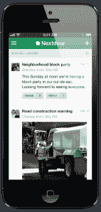
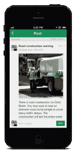
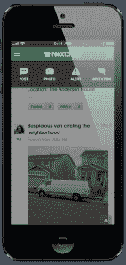

# Nextdoor 通过推出原生 iOS 应用 TechCrunch，将其专注于社区的社交网络引入 iPhone

> 原文：<https://web.archive.org/web/https://techcrunch.com/2013/05/23/neighborhood-nextdoor-for-iphone/>

# Nextdoor 通过推出原生 iOS 应用程序，将其专注于社区的社交网络引入 iPhone

Nextdoor 公司让人们创建只有本地邻居才能访问的私人社交网络，该公司发布了其首个 iOS 本地移动应用程序，iPhone 的 Nextdoor 公司。

此次发布正值总部位于旧金山的 Nextdoor 处于明显的强劲增长期。在本周的一次采访中，首席执行官 Nirav Tolia 表示，Nextdoor 现在已经为 50 个州的 12，600 个社区创建了私人网络，这比三个月前增加了 50%以上，当时 Nextdoor [在其系统上创建了大约 8，000 个社区](https://web.archive.org/web/20221004034017/https://beta.techcrunch.com/2013/02/12/nextdoor-closes-21-6-million-in-new-series-b-funding-to-take-its-neighborhood-focused-social-network-global/)，比 3 月下旬的 10，000 个社区有了显著提高。

对于 Nextdoor 的用户来说，此次发布也应该是一次受欢迎的首次亮相，因为到目前为止，30%的 Nextdoor.com 访客是通过移动浏览器访问的，30%的新用户邀请也是通过移动浏览器发出的。托利亚说:“手机应用是我们最需要的功能，过去一年也是如此。”。该公司目前正在开发一款 Android 应用，预计将在未来几个月内发布。

在我们的电话采访中，托利亚说，移动产品的推出可能会成为 Nextdoor 使用的“游戏规则改变者”，从意识到犯罪(如亚历克西亚的[慢跑——劝阻当地抢劫](https://web.archive.org/web/20221004034017/https://beta.techcrunch.com/2013/03/30/nextdoor-hits-10k-neighborhoods-gets-me-to-stop-running-at-night/))和自然灾害等紧急问题，到更日常的邻里事务，如丢失的宠物。“当你手中有一台相机和一个即时内容传输设备时，所有这些事情都会变得更好，”Tolia 说。您还可以使用该应用程序轻松地向您的邻居发送私人消息。

2011 年首次推出的[next door 已经从一系列重量级风险投资公司筹集了](https://web.archive.org/web/20221004034017/https://beta.techcrunch.com/2011/10/26/benchmark-backed-nextdoor-launches-as-a-private-social-network-for-neighborhoods/)[4020 万美元](https://web.archive.org/web/20221004034017/http://www.crunchbase.com/company/nextdoor)资金，其中包括 [Greylock Partners](https://web.archive.org/web/20221004034017/http://www.crunchbase.com/financial-organization/greylock) 、 [Benchmark](https://web.archive.org/web/20221004034017/http://www.crunchbase.com/financial-organization/benchmark-1) 、 [DAG Ventures](https://web.archive.org/web/20221004034017/http://www.crunchbase.com/financial-organization/dag-ventures) 、 [Shasta Ventures](https://web.archive.org/web/20221004034017/http://www.crunchbase.com/financial-organization/shasta-ventures) 、 [Allen & Company](https://web.archive.org/web/20221004034017/http://www.crunchbase.com/financial-organization/allen-and-company) 、 [Pinnacle Ventures](https://web.archive.org/web/20221004034017/http://www.crunchbase.com/financial-organization/pinnacle-ventures) ，以及新投资者[贝索斯探险队该公司大约有 50 名员工。](https://web.archive.org/web/20221004034017/http://www.crunchbase.com/financial-organization/bezos-expeditions)

下面是 iPhone 版 Nextdoor 的部分截图(点击放大):
