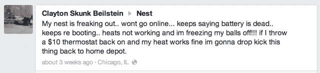
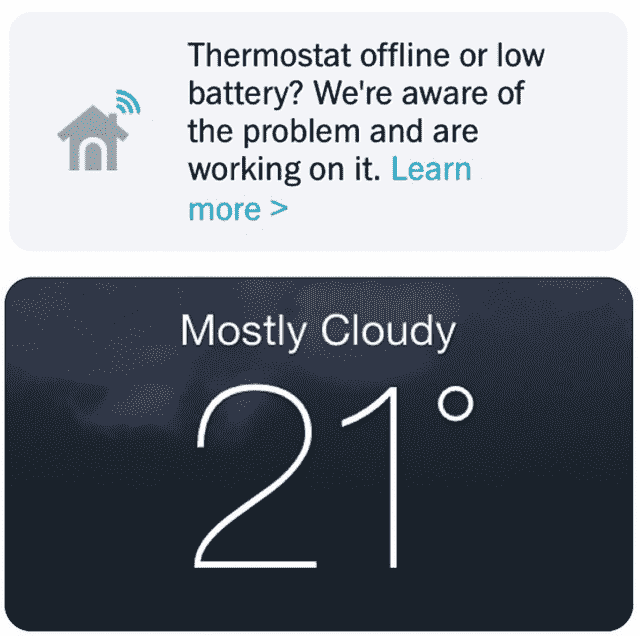
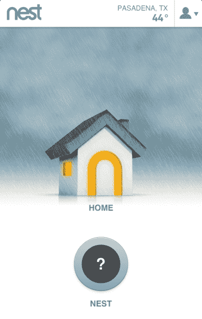

# 更新:Nest 表示关闭热量有时是它的错，也推动恒温器 4.0.1 固件修复 4.0 问题

> 原文：<https://web.archive.org/web/https://techcrunch.com/2014/01/06/nest-4-0-firmware-battery-problems/>

继上个月[有问题的 4.0 固件](https://web.archive.org/web/20230316161448/http://support.nest.com/article/Intermittent-low-battery-or-connectivity-issues-with-thermostat-software-4-0)导致 Wi-Fi 和电池问题后，Nest 现在推出了智能恒温器的 4.0.1 升级。2014 年 1 月 7 日更新:Nest 告诉我，4.0 版本的 bug 并不负责在隆冬季节关闭或调低人们的暖气，但 Nest 的硬件问题有时是罪魁祸首。其他原因包括不兼容的炉子和人们忘记更换空气过滤器。]

这部分解释了如果你查看 Nest 的[脸书墙](https://web.archive.org/web/20230316161448/https://www.facebook.com/nest?filter=2)或者在上面运行[推特搜索](https://web.archive.org/web/20230316161448/https://twitter.com/search?q=%40nest%20off&src=typd)会发生什么。

像克雷顿和 T2【理查德(见上图)这样的顾客已经蜂拥至社交媒体向[报告从烦恼到灾难不等的巢穴问题](https://web.archive.org/web/20230316161448/https://twitter.com/newcoventry/status/420250893393485824)。[有些](https://web.archive.org/web/20230316161448/https://www.facebook.com/nest/posts/684527288258306) [说](https://web.archive.org/web/20230316161448/https://twitter.com/BalanceBodySoul/status/419095140582449153) [他们已经](https://web.archive.org/web/20230316161448/https://twitter.com/philecker/status/420191273501212672) [半夜来到](https://web.archive.org/web/20230316161448/https://twitter.com/johnp/status/409132771626336256)家或者[被叫醒](https://web.archive.org/web/20230316161448/https://twitter.com/TXCraig/status/287552854514884608/photo/1)到一个[冰冷的房子里](https://web.archive.org/web/20230316161448/https://twitter.com/kerrywcooper/status/418925546265784320)。当他们调查他们的巢穴时，他们发现它反复开关，或者突然没电。在某些情况下，它会关闭或降低他们的热量。一位不幸的顾客因为他的房子变得太冷，所以他的水管冻住了。

一位用户写信给 TechCrunch，详细解释了他的 Nest 问题:

> “周五下午 4 点左右，我们的暖气毫无征兆地关闭了。经过检查，嵌套单元似乎陷入了一个无休止的能量循环。每次它通电时，它会显示旋转的蓝色装载指示器，然后会出现一条消息，指示我们将巢从底座上拆下来，然后重新连接上。重新连接后，设备显示一条消息，表明正在重新启动，并且该过程将无限期重复。
> 
> 我们遵循了在线故障排除指南，但没有成功。然后，我们试图呼叫支持，但遇到了令人印象深刻的长时间等待和一条消息，承认存在一个突破性的软件更改，似乎已经被推出，就在该国的大部分地区开始依赖他们的熔炉。"

[**2014 年 1 月 7 日更新** :
最初在与 Nest 交谈后，我得到的印象是，该公司认为不兼容、空气过滤器堵塞以及其他超出其控制范围的问题是人们失去热量的唯一原因。这就是为什么我发表了标题为“Nest 说关闭暖气不是它的错，但推动恒温器更新以解决 4.0 问题”的文章。但在今天与一名代表交谈后，该公司澄清说，在某些情况下，Nest 错误地告诉客户，当他们需要时，他们不需要[普通电线](https://web.archive.org/web/20230316161448/http://support.nest.com/article/When-Nest-needs-a-common-C-wire)来为他们的 Nest 恒温器供电。缺少必要的公共电线可能会导致 Nest 出现故障，并关闭或降低家庭供暖。一些用户错误地将这个问题归咎于 4.0 更新的错误，而事实上这并不相关。很高兴看到 Nest 现在更加明确地对严重影响客户的问题承担责任。]

虽然有许多[快乐的](https://web.archive.org/web/20230316161448/https://www.facebook.com/photo.php?fbid=10152079419060926&set=o.183824211661952&type=1)用户没有遇到[问题](https://web.archive.org/web/20230316161448/https://www.facebook.com/nest/posts/694884767222558)，但其他人却对[没有主动通知](https://web.archive.org/web/20230316161448/https://www.facebook.com/nest/posts/687819437929091)用户 4.0 的错误感到愤怒。相反，上个月 Nest 在其支持中心发布了关于“恒温器软件 4.0 间歇性低电量或连接问题”的信息。上面写着:

> “我们在最新的 4.0 恒温器软件中发现了一个错误，它影响了一小部分用户…受影响的用户将在恒温器上看到低电量警告，在应用程序中看到他们的恒温器间歇性地“离线”，并且无法使用 Nest 应用程序控制他们…截至 12 月 8 日周日，我们有一个短期解决方案，并已开始更新受影响的恒温器。我们正在将这些恒温器恢复到 3.5.3 版本，这应该可以解决问题。”

不幸的是，一些回滚到 3.5.3 的人正在经历一系列新的问题。由于大量新用户安装他们在圣诞节收到的 Nest 产品，联系支持的客户忍受着极其漫长的等待时间。那些通过电话或电子邮件获得帮助的人会得到[一长串指令](https://web.archive.org/web/20230316161448/https://www.facebook.com/nest/posts/694002540644114)来排除他们自己设备的故障。

受影响的客户要求 Nest 在推出更新之前对其进行更彻底的测试，或者至少提供一种关闭自动更新的方法。与此同时，一些人开始换回他们的旧的、便宜的模拟恒温器。

但今天，我与 Nest 的联合创始人马特·罗杰斯交谈，他说 4.0.1 更新已经准备好，现在正在推出。他还否认鸟巢问题切断了人们的热量。在一份声明中，该公司解释道:

> “正如支持中心消息中所述，4.0 更新导致一小部分客户失去 Wi-Fi 连接，因此无法远程控制温度。除了远程控制，它们的加热和冷却不受影响。在我们进行修复的同时，我们已经将其中许多客户回滚到 3.5.3 来解决 Wi-Fi 连接问题。在未来几天，我们预计将发布 4.0.1 版本，该版本具有与 3.5.3 相同的 Wi-Fi 性能，并具有 4.0 版本的所有伟大功能。
> 
> 对于遇到电池耗尽问题的小部分客户，我们根据具体情况与联系我们支持团队的用户进行合作，因为有许多因素会导致这种情况，包括空气过滤器堵塞的家庭，或者旧的或不寻常的 HVAC 布线。有时解决方法是使用电源线，有时客户的系统与 Nest 不兼容。澄清一下，这与 4.0 更新无关。"

似乎任何有问题或考虑购买鸟巢的人都应该确保更换他们的空气过滤器，并确保他们的炉子是兼容的。

尽管如此，Nest 仍需要更好地教育客户，加大支持力度，以避免因并非由它造成的问题而受到指责。否则，像这样的客户问题可能会动摇对 Nest right 的信心，因为 [Re/code 报道](https://web.archive.org/web/20230316161448/http://recode.net/2014/01/02/nest-raising-huge-new-round-from-dst-valuing-smart-home-startup-at-upwards-of-2-billion/)它正试图以 20 亿至 30 亿美元的估值筹集 1.5 亿至 2 亿美元。《财富》杂志的丹·普里马克说，这一轮“仍在进行中”

如果投资者担心 Nest 让一些最早采用者的意见变得不愉快，这项工作可能会变得困难得多，即使它不对问题负责。因为无论准确与否，人们在社交媒体上的观点都会影响他们朋友的购买习惯。

每种产品都有少数被抛弃的用户，我们无法确认客户报告的所有问题都完全是 Nest 的错。但是现在似乎有大量的不满。不过，不管怎样，罗杰斯听起来对困扰客户的 4.0 问题感到合理的悲伤，并告诉我“我们确实非常认真地对待这些事情，即使这不是我们的错。我们会接听支持电话，当人们有问题时，我们会随时提供帮助。”

随着我们越来越多地通过高科技设备管理我们的生活，这些设备的创造者将需要在稳定性和安全性上加倍努力。与工作或娱乐设备不同，Nest 的恒温器和烟雾探测器等设备是家庭基础设施的重要组成部分。软件缺陷不仅仅会带来不便，还会带来真正的生活质量和安全问题。当你参与到我们的生存中时，“快速行动，打破常规”是行不通的。