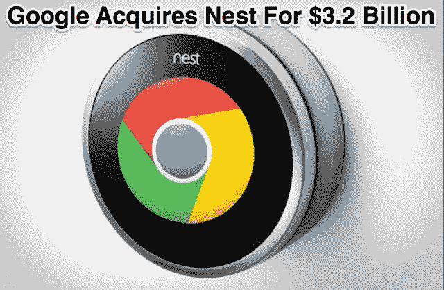

# 谷歌买 Nest 谁发财？凯鹏华盈 2000 万美元回报 20 倍，沙斯塔网约 2 亿美元

> 原文：<https://web.archive.org/web/https://techcrunch.com/2014/01/13/nest-investors-strike-it-rich/>

谷歌刚刚以 32 亿美元现金[收购了 Nest](https://web.archive.org/web/20230405154414/http://investor.google.com/releases/2014/0113.html) ，这意味着这家初创公司的早期投资者凯鹏华盈(Kleiner Perkins Caufield Byers)和沙斯塔风险投资公司(Shasta Ventures)已经赚得盆满钵满。多个消息来源称，凯鹏华盈在 Nest 投资了 2000 万美元，获得了 20 倍的回报，投资了 4 亿美元。[更新:与此同时，这笔交易返还了沙斯塔第二笔 2.5 亿美元基金的“几乎全部”。]

Nest 没有透露其[A 轮和 B 轮](https://web.archive.org/web/20230405154414/http://www.crunchbase.com/company/nest-labs)的规模或谁投资了多少。这使得很难确定谁在出售家庭自动化初创公司[销售智能恒温器和烟雾探测器](https://web.archive.org/web/20230405154414/https://techcrunch.com/tag/nest/)中获得了什么。

沙斯塔和 KPCB 在 2010 年 9 月资助了 Nest 的所有 A 轮融资，就在这家联网设备初创公司成立几个月后。随后在 2011 年 8 月，他们都参与了 Nest 的 B 轮投资，投资方还包括 Google Ventures、Lightspeed Venture Partners、Intertrust 和 Generation Investment Management。

多个消息来源称，凯鹏华盈(Kleiner Perkins)是 Nest 最大的投资者，能够在 A 轮和 B 轮投资 2000 万美元。我们的消息来源称，谷歌为 Nest 支付的 32 亿美元现金价格将为 KPCB 带来 20 倍的回报——这与《财富》杂志的丹·普里马克从消息来源获悉的 20 倍倍数相符。这笔钱来自 2010 年 6.5 亿美元的 KPCB 十四世基金，这意味着凯鹏华盈仅用其 Nest 投资就回报了该基金超过 60%的资金。这笔财富还将提升 KPCB 合伙人兰迪·科米萨尔的地位，他是投资的来源，也是 Nest 董事会的成员。

凯鹏华盈(Kleiner Perkins Caufield Byers)的胜利让人想起 20 世纪 90 年代投资谷歌、亚马逊、美国在线和 Intuit 的早期全垒打。最近，脸书和 Twitter 以及 Square 和 Spotify 等后起之秀纷纷退出，但直到后来几轮潜在回报低得多的时候。但有了 Nest，KPCB 就有了先机，当谷歌的收购正式完成时，它将从中获益。

Shasta Ventures 的董事总经理罗布·科尼比尔(Rob Coneybeer)领导了 Nest 的投资

至于 Shasta Ventures，今天是该公司及其董事总经理 Rob Coneybeer 的巨大胜利，我们听说他不懈地争取将 2.5 亿美元的 Shasta II 基金纳入 Nest 的 A 轮和 B 轮融资。

[ **更新**:一位熟悉谷歌收购 Nest 交易的消息人士告诉我们，沙斯塔的投资将为其带来足够的资金来归还 2.5 亿美元的沙斯塔 II 基金的“几乎全部”。这意味着沙斯塔从收购 Nest 的交易中获得了 2 亿美元或更多。]

Nest 的交易几乎肯定会超过其他 Shasta 的热门产品，比如被 Citrix 收购的[Zen price](https://web.archive.org/web/20230405154414/http://www.crunchbase.com/company/zenprise)和被 Intuit 收购的 [Mint](https://web.archive.org/web/20230405154414/http://www.crunchbase.com/company/mint) 。这些回报可能会增强有限合伙人的信心，并帮助 Shasta 筹集下一只基金。

谷歌风投今天也赚了大钱，因为它领投了 Nest 的 B 轮和 C 轮融资。哦，Nest 的创始人托尼·法德尔和马特·罗杰斯也是如此。

对于整个风险投资行业来说，收购 Nest 可能会给硬件企业家带来一个泡沫市场。如果像谷歌这样的公司为年轻的创业公司支付数十亿美元的现金，而不是软件，硬件制造商可能会更容易筹集大量资金，从车库搬到真正的实验室。

*【金-麦·卡特勒补充报道】*

*点击下面阅读关于谷歌购买 Nest 的完整报道:*

