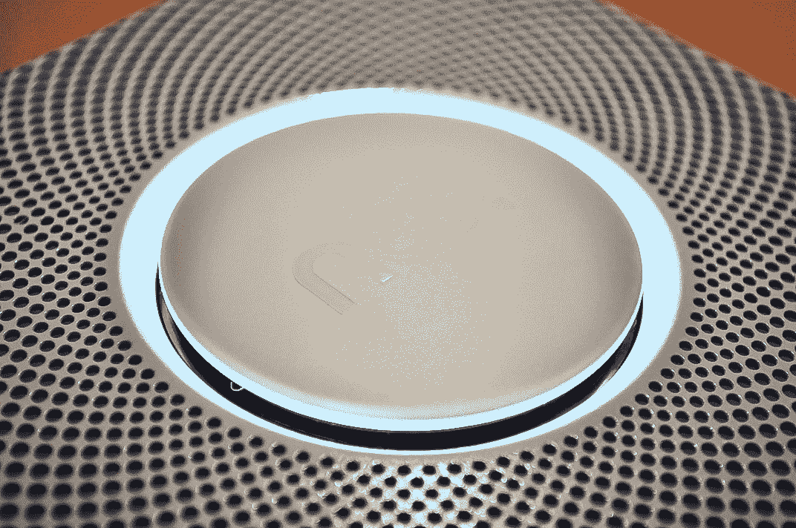

# Nest Protect 是一款售价 129 美元的烟雾和一氧化碳探测器，让 Nest 更深入地融入互联家庭

> 原文：<https://web.archive.org/web/https://techcrunch.com/2013/10/08/nest-protect-is-a-129-smoke-and-carbon-monoxide-detector-that-takes-nest-deeper-into-the-connected-home/>

由两位前苹果名人共同创立的家庭硬件制造商 Nest Labs 今天发布了其第二款产品 Nest Protect，这是一款 129 美元的智能设备，希望能为烟雾和一氧化碳检测市场做些什么，就像 Nest 的学习恒温器为家庭温度控制所做的那样。也就是说，它想把对许多人来说已经变得平淡无奇、运转不良的家庭必需品变成一种可靠而时尚的必需品。Nest Protect 设计巧妙，与智能手机相连，功能齐全，比它想要取代的功能更好，是这家初创公司迄今为止最大的一款产品，为自己赢得了全球声誉，并将自己定位为联网家庭中的重要参与者。

在所有扰乱家庭的事物中，为什么要用烟雾探测器呢？有几个原因，一个是个人原因，另一个是战略原因。

* * *

* * *

“是我躺在床上看着天花板的时候。我想，这东西是做什么的？今晚会吵醒我吗？它真的会正常报警吗？”Nest 的联合创始人兼首席执行官托尼·法德尔在一次采访中解释道。“每当我想到这件事，我(意识到)我对此一无所知。正是我天花板上的这个奇怪的产品让我很恼火。它从来没有真正安全地存在过。”法德尔与更多的人交谈，比如他的联合创始人马特·罗杰斯(Matt Rogers)，公司的其他人，以及他的妻子和朋友，他说每个人都有一个关于烟雾探测器的故事，都有一个共同的主题:“一个应该让你安全的产品，只是它很烦人。烦，烦，烦。”

然而，每年售出 3000-4000 万台。“为什么我们不喜欢或欣赏它们？这就是保护鸟巢的整个想法的起源。”

但不仅仅是销量和现有的劣质旧产品给 Nest Labs 带来了机会。虽然恒温器在本质上是一个(非常)好用的设备，但 Protect 将 Nest 带入了必需品的世界。在许多国家，烟雾探测器被强制安装在新房子里，保险公司和其他公司也要求你安装烟雾探测器。虽然 Nest 的恒温器存在一些缩放问题——例如在英国，人们不能简单地即插即用，而是因为电压差而必须让专业人员来安装设备——但 Protect 却不是这样，它采用电池供电的版本，可以工作，因此可以在全球范围内销售。

正如苹果公司已经采用了技术，并设法使其既光滑/有抱负，同时又人性化和个性化，Nest Labs 也希望在 Nest Protect 上做同样的事情。

“我们不只是想做一个更好的，”法德尔谈到白色和黑色的方形设备时说(是的，即使在美学上，Protect 也不同于今天探测器的圆形外观)。“我们想创造一些真正感性的东西。人们可以真正喜欢并在家中拥抱的东西，而不是因为政府告诉他们必须购买而购买。”

事实上，有许多关于保护的事情将产品从官僚主义订购的家庭必需品带入更私人的领域。首先，该设备有人声，目前可以设置为英语、西班牙语或法语。例如，如果它的电池电量低，如果它检测到一氧化碳，或者如果它将要发出非常大的警告噪音，声音就会以平静的方式警告你。“抬头，”是女性的常见重复，美国人的声音听起来很像美国的 Siri——也许不是巧合。

当闹钟响起时，它会同时发出更急迫的声音 Nest 表示，这是它在阅读了一项研究后创造的功能，该研究指出，儿童经常在闹钟铃声中睡觉，但会在声音响起时醒来。

然后，Nest 接收这些保证信号，并随之运行，比如它称之为“每夜承诺”的功能这是你关灯后设备发出的绿光，让你知道它在工作。如果你在黑暗中从它下面走过，它会探测到你的动作并为你指路。

人情味从那里继续。如果警报可能反应过度，而不是按下许多按钮或愤怒地撕掉 9 伏电池(两者通常都涉及爬到椅子或梯子上这样做)，你只需挥动你的手臂——这不仅是对过去你可能用抹布进行的疯狂空中打击的双重致敬，也是对 21 世纪手势控制小工具的浪潮的致敬。

“触摸”和“人类”一样是一个关键词。虽然烟雾报警器通常完全位于天花板上，但 Nest 遵循了许多硬件制造商的路线，并创建了智能手机和平板电脑应用程序，让你与探测器通信并控制探测器。这些应用程序——完全重写，以便它们也可以与 Nest 的学习恒温器一起用于一些生态系统建设——提醒用户低电量警告、警报通知和一键访问紧急号码。您可以使用该应用程序同时监控多个 Protect 检测器。

这些探测器还一起工作，提醒你房子里其他房间的问题。当然，即使你不在家，这些应用程序也能工作，当你不在家时，你可以远程监控是否有任何烟、火、热或一氧化碳问题。

Nest Protect 并不是该公司第一款产品 Nest Learning 恒温器的快速后续产品，该产品于两年前在 T2 几乎同一周推出。但这也是意料之中的事。

Nest Labs 的首席执行官托尼·法德尔通常被称为 iPod 之父(也许我们可以称他为 T2 的共同母公司)。这使得他和 Nest Labs 立即吸引了人们的注意力，[有时会挫败](https://web.archive.org/web/20230326125755/http://jessicalessin.com/2013/09/24/exclusive-next-for-nest-a-smoke-detector/)该公司迄今为止对此次发布保密的最大努力。

正如 Nest 一直在迭代它的学习恒温器(最近开放了它的 API)，我们可以期待在未来看到更多来自 Nest Protect 的东西。

借鉴充满传感器的智能手机应用程序制造商使用的剧本，你也可以想象 Nest 将提出更多方法来使用 Protect 内置的许多传感器来推出更多服务。Nest 在设备中公开的传感器包括光电烟雾传感器、CO 传感器、热传感器、光传感器、超声波传感器和活动传感器。“我不知道我们还会做什么，但看起来未来会有很多令人兴奋的事情，”法德尔说。考虑到 Nest 并不是唯一一个追逐智能烟雾探测器市场的公司，这一点也很重要(这里的和这里的是另外两个玩家)。

[幻灯片包含="890049，890048，890047，890046，890045，890041 "]

举个例子，你可以想象几个这样的系统作为一个房屋报警系统工作(记住，它叫做“保护”)。因此，毫不奇怪，Nest 表示，2014 年，Nest Protect 将与有线安全系统集成。然而，这不仅仅是一个硬件游戏:这也将 Nest 设置为一个单独的应用程序，可以充当运行所有联网家庭设备的中枢。

我们有一个关于该设备如何工作以及如何安装的实际操作演示，来自联合创始人兼工程副总裁 Matt Rogers，他大胆地让我们在他办公室的一面墙上安装 Nest Protect，看看它是如何工作的(这个家伙！阿米利特？).请继续关注这条新闻，聆听独一无二的托尼·法德尔讲述他是如何想出“保护巢穴”、“抵御作为噱头的额外功能”等创意的。

Nest Protect 的两款黑色和白色型号将于 11 月通过亚马逊、苹果、百思买和家得宝以有线(120V)和电池供电版本销售，首先在美国、英国和加拿大开始销售。

* * *